# Creation and Configuration of Workshop Environment

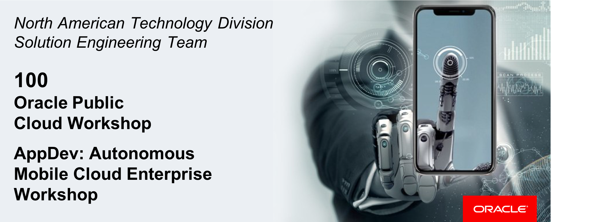  
Update: March 31, 2017

## Introduction

This is the first of several labs that are part of the Oracle Public Cloud **AMCe Application Development workshop.** This workshop will walk you through the Software Development Lifecycle (SDLC) for a dual-channel application (web + mobile) built using Oracle's **Autonomous Mobile Cloud Enterprise (AMCe)** as a complete backend solution.

In this workshop you will take on several different roles as the key developer of a hypothetical credit union. In this lab, you will act as the **AMCe service admin** who will create the AMCe **Mobile Backend (MBE)** project, create **IDCS Groups** and **Roles** for mobile user managament, enable access to **IDCS** APIs, and acquire neccessary authentication credentials.

**Please direct comments to: [Nolan Corcoran](nolan.corcoran@oracle.com)**

## Objectives

- Create Initial Project
  - Explore Initial Mobile Backend
- Configure Development Environment
  - Set Environment Policies
  - Create User Roles
  - Create & Configure User Groups
- Configure API Access
  - Add API Access in IDCS
  - Acquire Auth Credentials

## Required Artifacts

- The following lab requires an Oracle Public Cloud account that will be supplied by your instructor.

# Create Credit Union Project

## Create AMCe Mobile Backend

### **STEP 1**: Login to your AMCe environment using IDCS

- From any browser, go to the URL of your AMCe environment.

- If you are not already logged in, you will be redirected to the IDCS login page. There, enter your User Name and Password and click **Sign In**:

  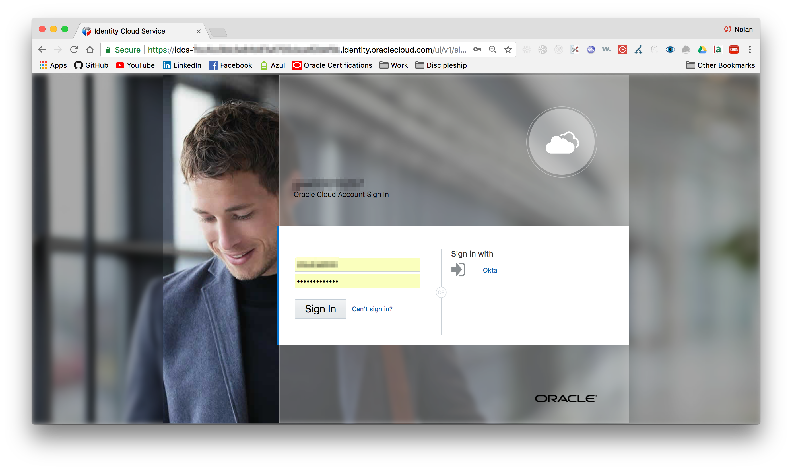

- If you successfully log in, you will be redirected to the AMCe landing page. Here you are provided helpful information to get you started working with AMCe. At the top is a multi-page banner with links to tutorials, videos, sample app downloads, and official AMCe documentation **(1)**. Beneath this banner, on the left, are video tutorials of key AMCe features **(2)** and, on the right, a helpful guide to learning AMCe based on different roles that might be using the platform **(3)**.

  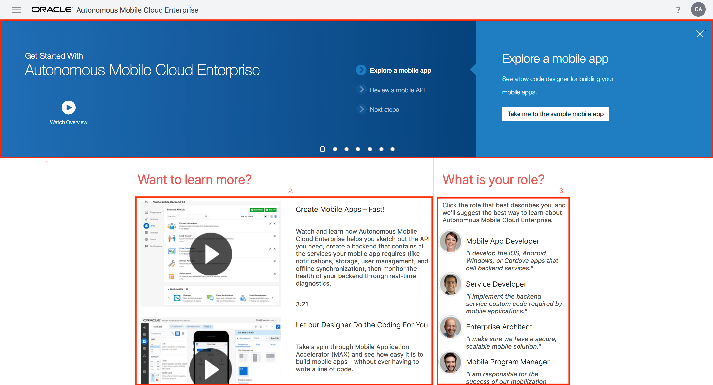

### **Step 2**: Explore your AMCe environment

- To start exploring **Autonomous Mobile Cloud Enterprise** for ourselves, first **click** on the hamburger menu (  ) to pull up the sidebar navigation menu. In this menu, we have three dropdown menus corresponding to the high-level features of AMCe: **(1)** Application **Development**, **(2)** API Request **Diagnostics**, and **(3)** Environment **Settings**. Also included here are links to Oracle's official AMCe **Downloads** and **Documentation**.

  

- In this workshop we will be working mostly with the Application **Development** feature. If we click on **Development**, we're taken to a dashboard with each of the key **Development** features and services, mirrored by the dropdown menu on the left.

  

### **STEP 3**: Create New Mobile Backend (MBE)

**AMCe** was built around the concept of mobile backends, which enable you to develop and deploy different microservices in an integrated fashion by associating them with the same backend. Thus, the **Backends** feature is our starting point and, as we go, we will create several of the available backend microservices such as Custom **APIs**, Client Apps + **Notification Profiles**, Object **Storage**, and Mobile Users + **Roles**.

- Click on **Backends** to take you to a list of Mobile Backends (**MBEs**).

  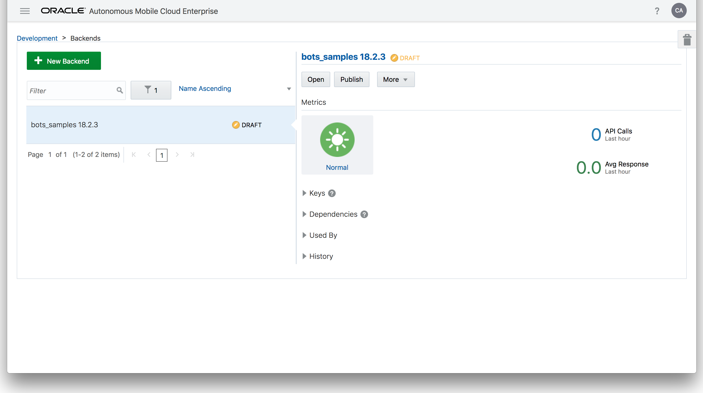

- Click on **+ New Backend** and fill out the **MBE** creation form as follows:

  **Name**: `CreditUnion`

  **Description**: `MBE for Credit Union Application(s)`

- After your new MBE has been successfully created, you will be redirected to your **MBE** page.

  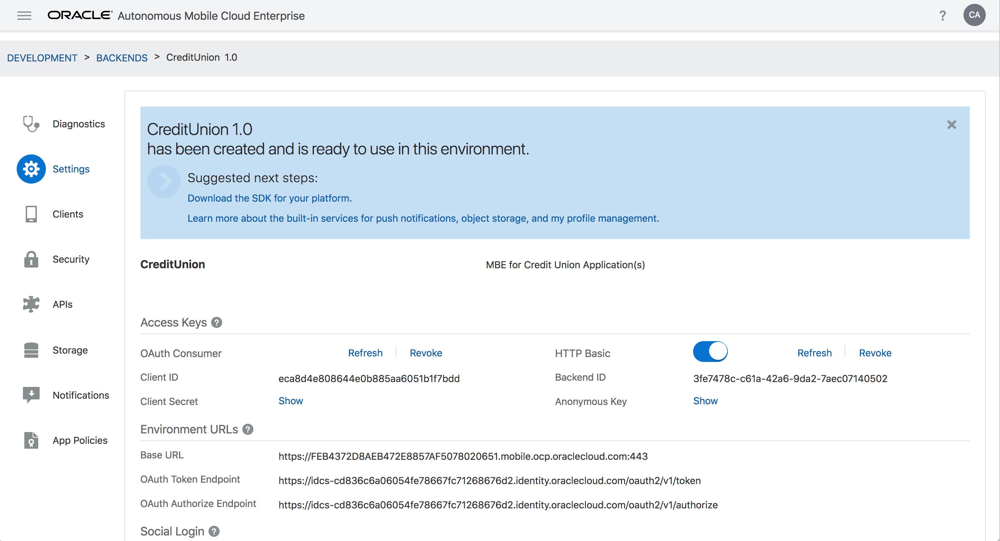

### **STEP 4**: Explore Mobile Backend Page

Most of creation and configuring of our backend microservices will be done through this main backend page so as to automatically associate them with the parent backend. Otherwise, if we created any standalone microservice, we would have to manually associate it with our backend in order to use it.

- On the left side of the page is a navigation menu with most of the previously mentioned microservices as well as MBE-specific **Diagnostics**, **Settings**, **Security**, **Notifications**, and **App Policies**.

  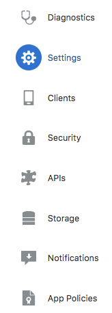

- We will go more in depth into several of these features/services in later labs but, for now, let us take a look at our MBE **Settings**. Here we have several important pieces of information unique to our backend that we want to save in the `config.js` found in the `env/` directory of our workshop code (cloned in the pre-lab). In particular, copy/paste the following **Access Keys** and **Environment URLs**:
  - `Client ID`
  - `Client Secret`
  - `Backend ID`
  - `Anonymous Key`
  - `Base URL`
  - `OAuth Token Endpoint`

- While you are already editing to the `config.js` file, in the `auth` field of the JSON object, replace `<AMCE_USER>` and `<AMCE_PW>` with your AMCe username and password. Finally, replace `IDCS_HOST_URL` with the same `OAuth Token Endpoint` value only remove the trailing `/oauth2/v1/token` endpoint.

# Configure AMCe Environment

## Set Environment Policies

### **STEP 5**: Export Current Policies File

Before we actually begin working on our new MBE, we need to first configure our AMCe environment to allow for Cross Origin Resource Sharing (CORS), create **Roles** for our different MBE users, and, lastly, create user **Groups** corresponding to our user **Roles**.

- Click the **Settings** dropdown in the main navigation menu and followed by **Policies**.

  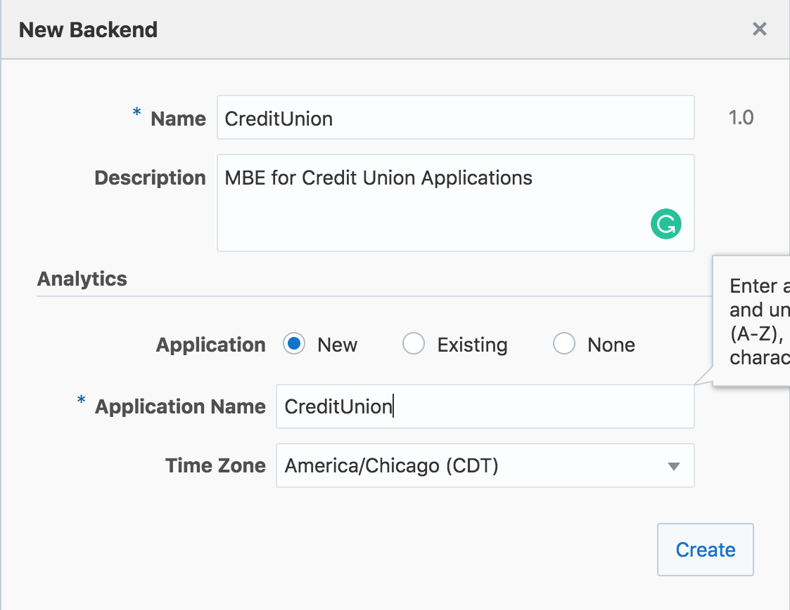

- Click the **Export** button to download the current policies file

### **STEP 6**: Add Anonymous Access Policy

For now, we will only be configuring CORS for our local dev environment URL but we will need to add our production environment URL once we have deployed our web app in later labs.

- Using a text editor, open the policies file you just downloaded, find the line with the policy `*.*.Security_AllowOrigin` and replace `disallow` with `http://localhost:3000`.

- Save the file and, back in your AMCe environment, upload the updated policies file by either clicking **Import a policies file** or by dragging the file into the page. Doing so successfully will display the following message:

  

## Create User Roles

### **STEP 7**: Create LoanProcessor Role

In order to secure our backend, we must restrict access to resources based on the role of the user making the request. As mentioned before, the two user roles that will access our backend and that we need to create will be the credit union's **LoanProcessor** and the auto **Dealer**.

- In the main navigation menu, click the **Development** dropdown and then **Roles**.

- Click on **+ New Role** and fill out the creation form as follows:

  **Role Name:** `LoanProcessor`

  **Description:** `A credit union's loan processor who communicates with the contact at an automobile dealership`

  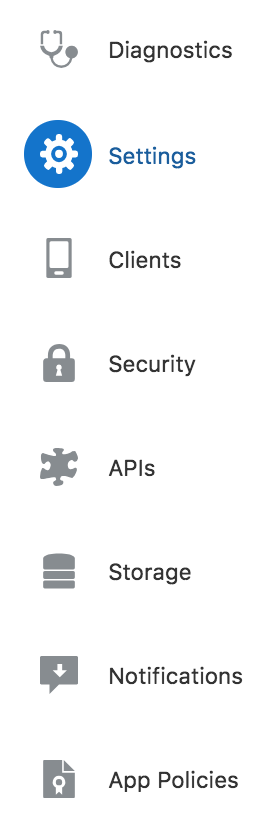

### **STEP 8**: Create Dealer Role

Next, we will create the **Dealer** role for the auto dealership contacts which will be the users of the credit union's mobile applciation.

- Click on **+ New Role** again and fill out the creation form as follows:

  **Role Name:** `Dealer`

  **Description:** `Dealership contact who communicates with the loan processor of a credit union`

  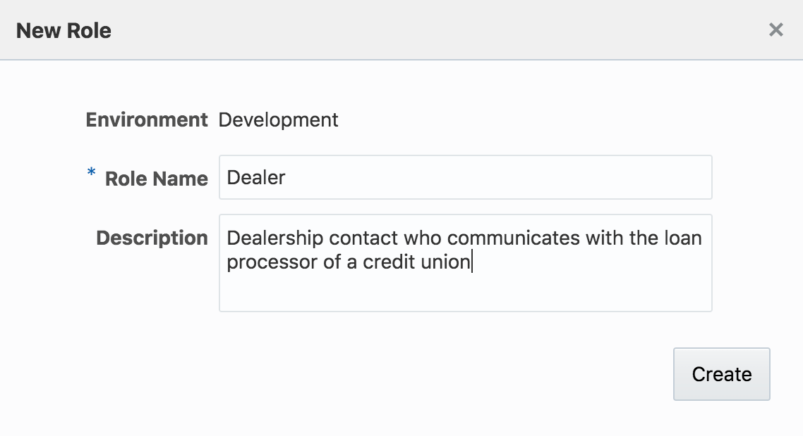

## Create & Configure User Groups

### **STEP 9**: Create User Group for LoanProcessor Role

**AMCe** has the added benefit of utilizing **IDCS** as its out-of-the-box user authentication solution. When we implement user registration, we must not only create the new user, but we must assign them the appropriate **Role** so they can access our MBE. To make this easier, we will create a User **Group** for each **Role** and assign that **Role** to every member of that group. This way, when we add a new user, we just need to additonally add him to the appropriate group.

- To navigate to our **IDCS** environment: (1) click the **Development** dropdown in the main navigation menu, (2) click **Instance Details** at the top of the dashboard page, (3) make a note of your `IDCS App Name` & `Team Member App Name` and lastly, (4) click the link next to `IDCS App Name` to open your **AMCe** environment's **IDCS** application page.

  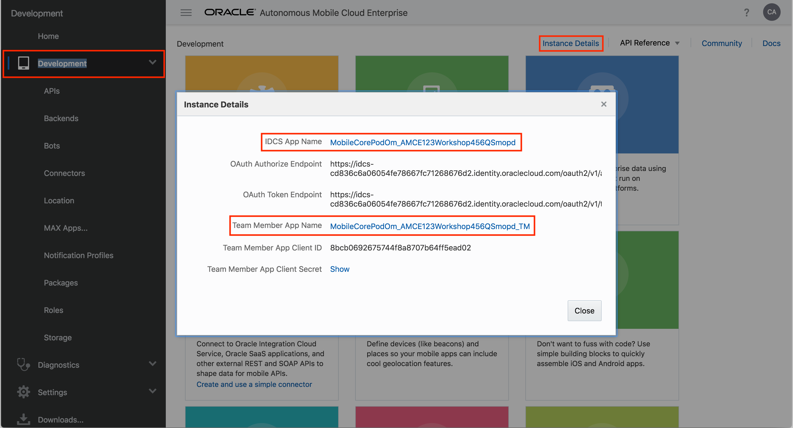

- To navigate to the **IDCS** **Groups** page, click the hamburger (  ) button and then click **Groups** in the side navigation menu.

  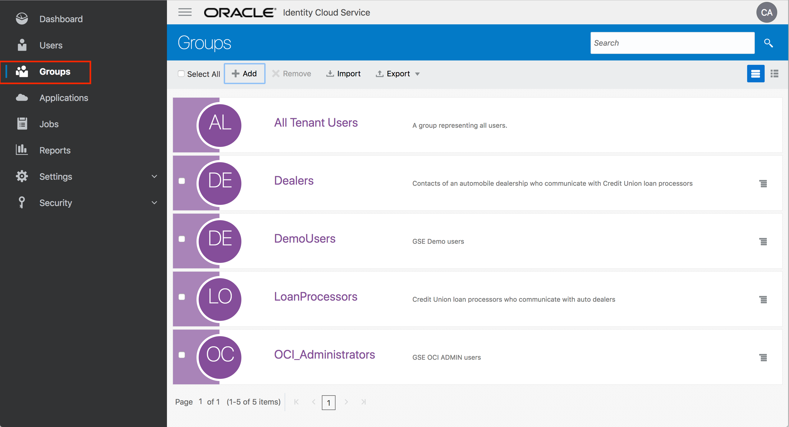

- Click the **+ Add** button at the top, leave the `User can request access` box unchecked, and fill out the **Group** creation form as follows and then click **Next**:

  **Name:** `LoanProcessors`

  **Description:** `Credit union loan processors who communicate with the contact at an automobile dealership`

  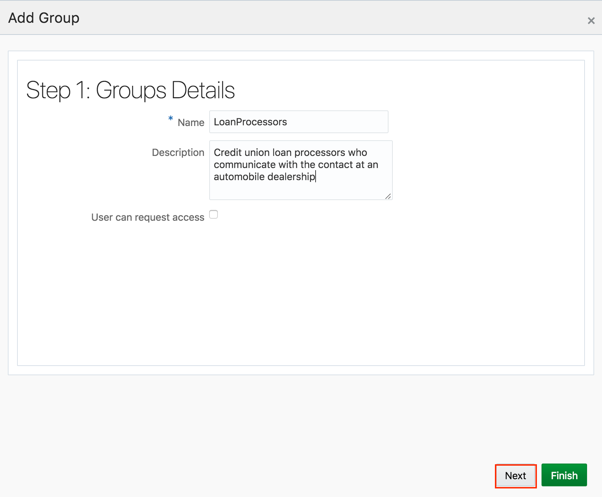

- As the developer and tester of both applications, we will go ahead and add ourselves to each group. Check the checkbox beside your user information and click **Finish**.

- Lastly, we need to grant this group access to your `AMCe Team Member App`. Click the **Access** tab and then click the **+ Assign** button. Find and check the application that that matches the `Team Member App Name` you made note of earlier and click **OK**.

### **STEP 10**: Create User Group for Dealer Role

- Click **Groups** in the side navigation bar once more to teturn to the main **Groups** page. Click the **+ Add** button at the top, leave the `User can request access` box unchecked, and fill out the **Group** creation form as follows and then click **Next**:

  **Name:** `Dealers`

  **Description:** `Dealership contacts who communicate with the loan processor of a credit union`

  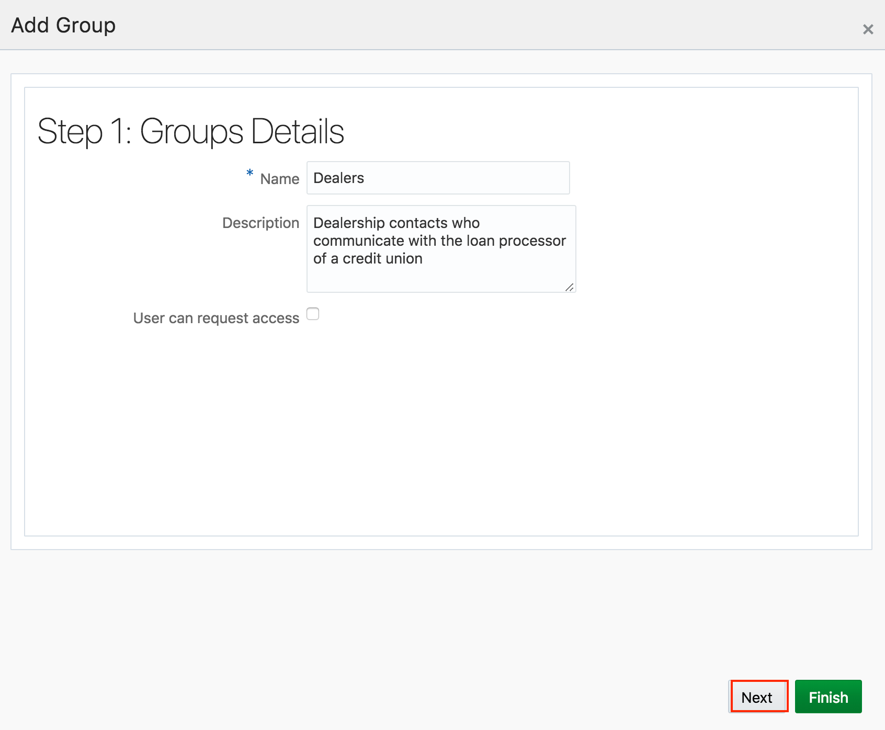

- In **Step 2**, check the checkbox beside your user information and click **Finish**.

- Click the **Access** tab and then click the **+ Assign** button. Find and check the application that that matches the `Team Member App Name` you made note of earlier and click **OK**.

### **Step 12**: Assign Roles to Group Members

- Click **Applications** in the side navigation bar and **click** the application that exactly matches `IDCS App Name` you made note of earlier.

- Click the **Application Roles** tab, **click** the dropdown menu button for the **LoanProcessor** Role, and then click **Assign Groups**.

  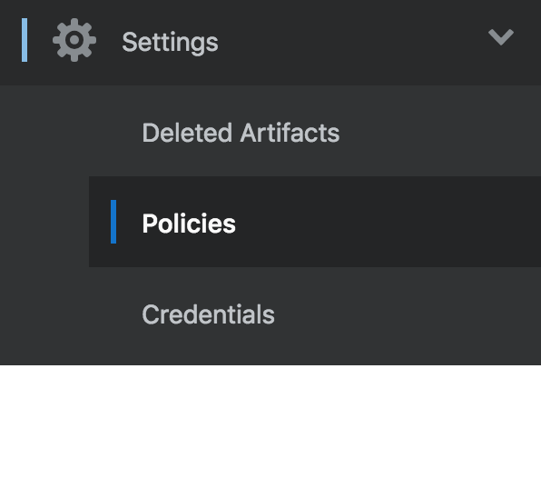

- Check the checkbox besides the **LoanProcessors** Group and then click **Assign**.

  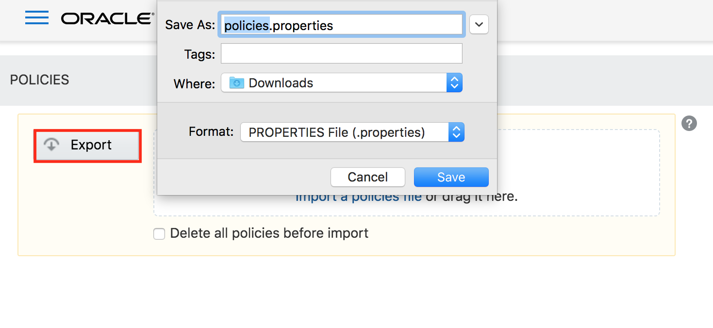

- Follow the same process again but this time for the **Dealer** Role. Afterwards, your **Application Roles** tab should look like this:

  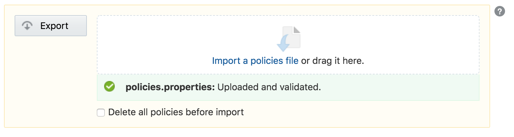

# Configure API Access

## Add IDCS API Access

### **STEP 13**: Grant client access to IDCS Admin APIs

When you create any **AMCe** mobile backend (MBE), **IDCS** automatically creates an associated **Trusted Application**. To access the **IDCS Admin APIs**, we need to grant the **Identity Domain Administrator** role client access to the API within the **Client Configuration** of our MBE's **IDCS** application.

- Click **Applications** from the dropdown and find/click the application associated with your **AMCe** MBE. The application name usually will start with the form `<AMCe Environment Name>QSmopd_<MBE Name>` followed by the MBE version number and then unique hash value.

  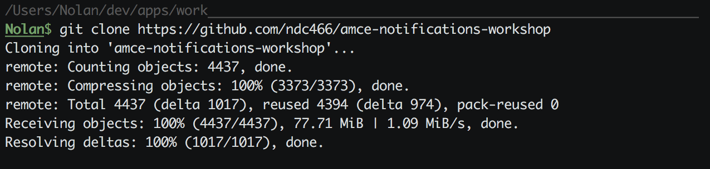

- Click the **Configuration** tab and, at the very bottom of the **Client Configuration** dropdown, under **Grant the client access to Identity Cloud Service Admin APIs.**, add **Identity Domain Administrator** to the list of roles and click **Save**.

  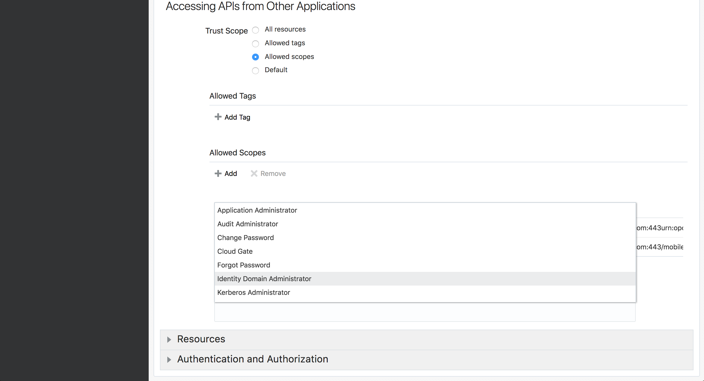

### **STEP 14**: Set Environment Parameters in Postman

Lastly, in our **IDCS** console, we want to edit our own user information and add our **Mobile Phone Number** as we will be using this for our mobile app in later labs.

- In the sidebar menu, click **Users**, then click **<Your Name>**, add your mobile number to **Mobile Phone Number**, and then click the green **Update User Button**.

## Acquire Auth Credentials

### **STEP 15**: Set Environment Parameters in Postman

The last step we need to take to enable developer access to the **IDCS REST API** is to acquire an OAuth access token, determine your unique **IDCS User ID** and the unique **IDCS Group IDs** of the two groups we just created, and, lastly, save all of this information to our `config.js` file. To simplify this, we will use a preconfigured Postman IDCS environment to make the requests needed to generate these values.

- Follow step 2 of the instructions found [here](http://www.oracle.com/webfolder/technetwork/tutorials/obe/cloud/idcs/idcs_rest_postman_obe/rest_postman.html#SettheEnvironmentParametersinPostman)

### **STEP 16**: Import the Postman Collection and Global Variables

- Follow step 3 of the [instructions](http://www.oracle.com/webfolder/technetwork/tutorials/obe/cloud/idcs/idcs_rest_postman_obe/rest_postman.html#ImportthePostmanCollectionandGlobalVariables).

### **STEP 17**: Acquire an OAuth Access Token

- Follow step 4 of the [instructions](http://www.oracle.com/webfolder/technetwork/tutorials/obe/cloud/idcs/idcs_rest_postman_obe/rest_postman.html#RequestanAccessToken). Copy the access token generated and, in `auth` section of your `config.js` file, replace `<IDCS_OAUTH_ACCESS_TOKEN>` with the copied value.

### **STEP 18**: Acquire your IDCS User ID

- Follow step 6 of the [instructions](http://www.oracle.com/webfolder/technetwork/tutorials/obe/cloud/idcs/idcs_rest_postman_obe/rest_postman.html#TestOtherUserAPICalls) except instead of the `Create a user` POST request, make the `List all users` request found in the `Users/Search/` folder of your Postman requests collection. In the response body, find the user associated with yourself and copy/paste the **id** value in place of `<IDCS_USER_ID>` in `auth` section of your `config.js` file.

### **STEP 19**: Acquire IDCS Group IDs

- Follow the same process of adding the unique **IDCS ID** values to the corresponding variables in your `config.js` for each group we created in **step 9** and **step 10**. 
  To list all the group objects, use the `List all groups` GET request found in the `Groups/Search/` folder of your Postman requests collection. In the response, find each of the groups we created in **step 9** and **step 10** and copy the corresponding `id` values. Then, in the `auth.groupIds` section of our `config.js` file, and replace the key/value pairs with each group's respective group name and group id.

- You are now ready to move to the next lab.