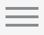

# Creation and Configuration of Storage Microservices

  
Update: March 31, 2017

## Introduction

This is the second of several labs that are part of the **Oracle AMCe Push Notifications workshop.** This workshop will walk you through the Software Development Lifecycle (SDLC) for a native mobile application built using Oracle's Autonomous Mobile Cloud Enterprise (AMCe), including **Push Notifications** as well as several other key microservices provided by the platform.

In the first lab (100), you created a new Mobile Backend (MBE) project in your Autonomous Mobile Cloud Enterprise (AMCe) environment. You also configured your environment by adding Roles for the two users of our MBE, Admins and Dealers. Lastly, we set our environment policies to allow anonymous access to the Loans storage collection. In this lab we will go ahead and actually create the Loans storage collection in our AMCe environment, upload our initial data objects, and use built-in, Storage REST API testing service to access our loan data objects.

***To log issues***, click here to go to the [github oracle](https://github.com/oracle/cloud-native-devops-workshop/issues/new) repository issue submission form.

## Objectives
- Access Autonomous Mobile Cloud Enterprise (AMCe)
- Create & Configure New Storage Collection
- Upload Data Objects to Storage Collection
- Test REST API Access to Storage Collection

## Required Artifacts
- The following lab requires an Oracle Public Cloud account that will be supplied by your instructor.

# Create Storage Collection

## Create New Loans Collection

### **STEP 1**: Login to your AMCe environment using IDCS
- From any browser, go to the URL of your AMCe environment

- If you are not already logged in, you will be redirected to the IDCS login page. There, enter your User Name and Password and click **Sign In**.:

    

- If you successfully log in, you will be redirected to the AMCe landing page.

    

### **Step 2**: Navigate to your CreditUnion Mobile Backend (MBE) Storage Collections

In order to create our backend microservices and have them automatically be associated, we will create them with the storage option within the CreditUnion MBE we created in the previous lab.

- To navigate to our CreditUnion MBE, first **click** on the hamburger menu  to pull up the sidebar navigation menu. Then, click on the **Mobile Apps** dropdown and click on the **Backends** option. This will take us to a list of backends we have previously created. From there, click on the backend named **CreditUnion**. Finally, to go into our MBE, click the **Open** button.

  

- Now that we are in our CreditUnion MBE, click **Storage** in the inner menu on the left side to navigate to the associated storage collections.

  

- In this workshop we will be working mostly with **Mobile Apps**. If we click on **Mobile Apps**, we're taken to a dashboard with each of the **Mobile Apps** features and services which is mirrored by the dropdown menu on the left. 

    

### **STEP 3**: Create New Mobile Backend (MBE)

Autonomous Mobile Cloud Enterprise (AMCe) was built around the concept of mobile backends, which enable you to develop and deploy different microservices in an integrated fashion by associating them with the same backend. Thus, the **Backends** service is our starting point and, as we go, we will create several of the provided backend microservices such as Client Apps & **App Profiles**, Custom **APIs**, Object **Storage**, and Mobile Users & **Roles**.

- Click on **Backends** to take you to a list of Mobile Backends (MBEs).

  

- Click on **+ New Backend** and fill out the MBE creation form as follows:
  - **Name**: `CreditUnion`
  - **Description** (optional): `MBE for Credit Union Application(s)`
  - **Analytics**:
    - **Application**: `New`
    - **Application Name**: `CreditUnion`
    - **Time Zone**: `Whatever floats your boat`
  
  

- After your new MBE has been successfully created, you will be redirected to your MBE page.

  

### **STEP 4**: Explore Mobile Backend Page

Most of creation and configuring of our backend microservices will be done through this main backend page so as to automatically associate them with the parent backend. Otherwise, if we created any standalone microservice, we would have to manually associate it with our backend in order to use it. 

- On the left side of the page is a navigation menu with most of the previously mentioned microservices as well as **Diagnostics**, MBE **Settings**, **Security**, **Notifications**, and **App Policies**. 

  

- We will go more in depth into several of these features/services in later labs but, for now, let us take a look at our MBE **Settings**. Here we have several important pieces of information unique to our backend. In particular, we want to make a note of the **Backend ID** under **Access Keys** as we will be needing it in following labs.

    

# Configure AMCe Environment

## Create User Roles

### **STEP 5**: Create Admin Role

Before we actually begin working on our new MBE, we first need to configure our AMCe environment to provide the necessary access for the different types users of our MBE. We won't go into much detail here but the two things we will do are (1) create **Roles** for our MBE users and (2) edit our environment **Policies** to allow anonymous access to our shared storage collections.

First we will create the **Admin** role for any users of our AMCe environment.

- Click on **Roles** in the main navigation menu

    

- Click on **+ New Role** and fill out the creation form as follows:

    **Role Name:** `Admin`

    **Description:** `Admin who is either an AMCe developer or a loan processor of a credit union.`

    

### **STEP 6**: Create Dealer Role

Next, we will create the **Dealer** role for the auto dealership contacts which will be the users of our Credit Union mobile applciation.

- Click on **+ New Role** again and fill out the creation form as follows:

    **Role Name:** `Dealer`

    **Description:** `Dealership contact who communicates with the loan processor of a credit union.`

    

## Set Environment Policies

### **STEP 7**: Export Current Policies File

In the next lab we will be creating the object storage collections the data that is to be visualized in our mobile application. To allow anonymous access to this shared collection we will add this setting to our environment policies file.

- Click the **Settings** dropdown in the main navigation menu and followed by **Policies**.

    

- Click the **Export** button to download the current policies file

    

### **STEP 8**: Add Anonymous Access Policy

- Using a text editor, open the policies file you just downloaded and, anywhere in the file, add a new line with the following policy:

`*.*.Security_CollectionsAnonymousAccess=Loans(1.0)`

- Save the file and, back in your AMCe environment, upload the updated policies file by either clicking **Import a policies file** or by dragging the file into the page. Doing so successfully will display the following:

    

## Download Project Code

### **STEP 9**: Download Project Code

The last step in setting up our environment before beginning the actual work on our project is to download the project code repository. The repository is not complete which will allow us to fill in the missing pieces but what it does do is give us the proper template to organize the phases of our project.

- In your terminal, in the directory you want the root of your project to reside, paste the following:

`https://github.com/ndc466/amce-notifications-workshop`

  

- Type `cd acme-notifications-workshop` and then `ls` and you should see the following project structure:

- You are now ready to move to the next lab.