# Create Custom API with API Designer

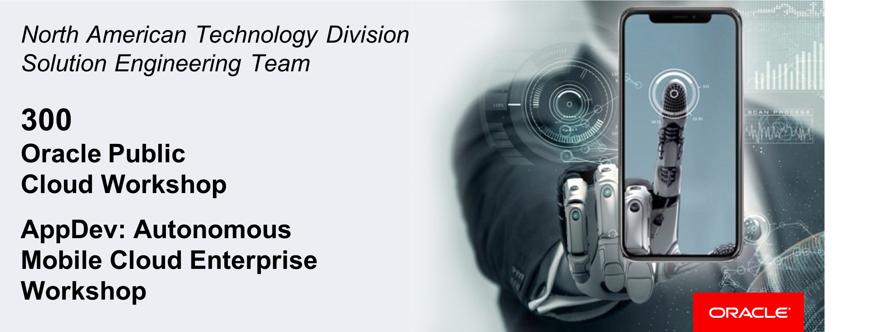  
Update: March 31, 2017

## Introduction

This is the third of several labs that are part of the Oracle Public Cloud **AMCe Application Development workshop.** This workshop will walk you through the Software Development Lifecycle (SDLC) for a dual-channel application (web + mobile) built using Oracle's Autonomous Mobile Cloud Enterprise (AMCe) as a complete backend solution.

In the first lab (100), you created a new Mobile Backend (MBE) project and configured your Autonomous Mobile Cloud Enterprise (AMCe) environment. In the second lab (200), you created, populated, and tested your MBE's storage collections. In this lab, you will use the AMCe API Platform to design and deploy a custom API.

**Please direct comments to: [Nolan Corcoran](nolan.corcoran@oracle.com)**

## Objectives
- Create Initial Custom API
- Create New Resource Endpoints
- Add HTTP Request Methods to Resource Endpoints
- Install AMCe CLI Tools
- Upload Implmentation Code
- Test API Implementation

## Required Artifacts
- The following lab requires an Oracle Public Cloud account that will be supplied by your instructor.

# Create Custom API

## Create Initial Custom API

### **STEP 1**: Login to your AMCe environment using IDCS
- From any browser, go to the URL of your AMCe environment

- If you are not already logged in, you will be redirected to the IDCS login page. There, enter your User Name and Password and click **Sign In**.:

  

- If you successfully log in, you will be redirected to the AMCe landing page.

  

### **Step 2**: Create Initial Custom API

In order to create our custom API microservice and have it automatically be associated with our MBE, we will create the custom API with the API section of our CreditUnion MBE page.

- To navigate to our CreditUnion MBE, first **click** on the hamburger menu (  ) to pull up the sidebar navigation menu. Then, click on the **Development** dropdown and click on the **Backends** option. This will take us to a list of backends we have previously created. From there, click on the backend named **CreditUnion**. Finally, to go into our MBE, click the **Open** button.

  

- Now that we are in our CreditUnion MBE, before we go ahead and create the custom API, let's update our MBE Security. Click **Security** in the inner menu on the left side to navigate to the associated MBE security. From there, toggle the **Role-based Access** option and add the **LoanProcessor** and **Dealer** Roles.

  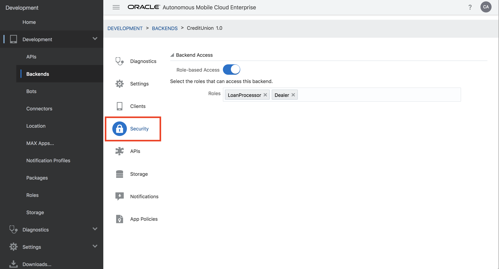

- Next, click **APIs** from the MBE page navbar and then click the **API** option from the **+ New API** dropdown.

  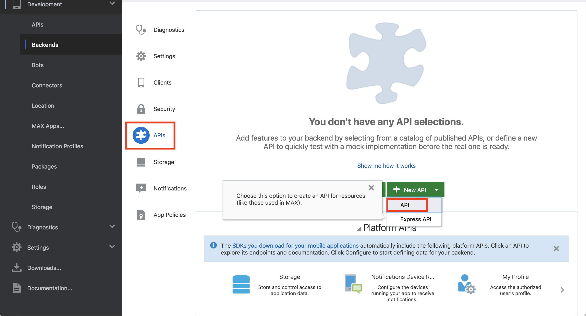

- Fill out the API creation form as follows and then click **Create** to take you to your Custom API page:

  **API Display Name:** `Sideband Notifications API`

  **API Name:** `SidebandNotificationsAPI_<AMCE_USERNAME>`

  **Short Description:** `Custom API for the sideband notification channel application`

  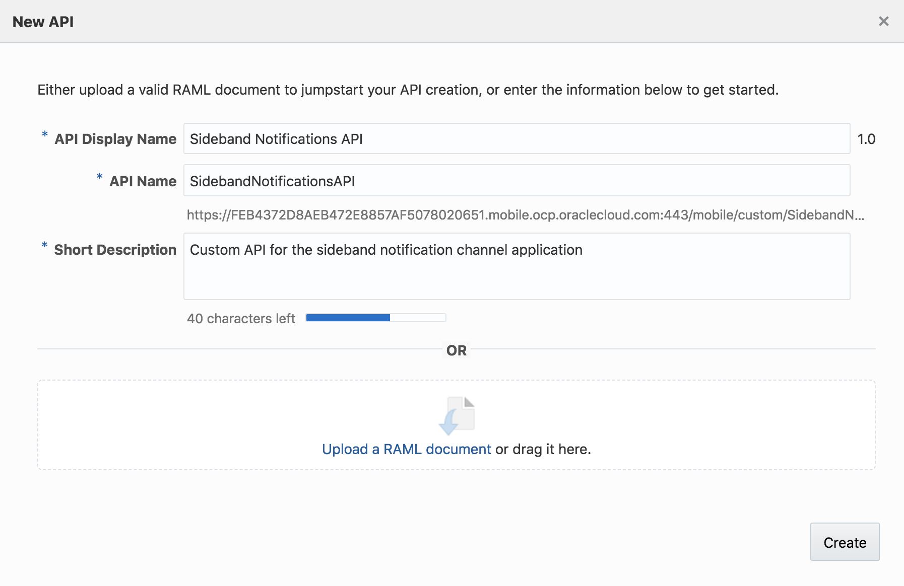

  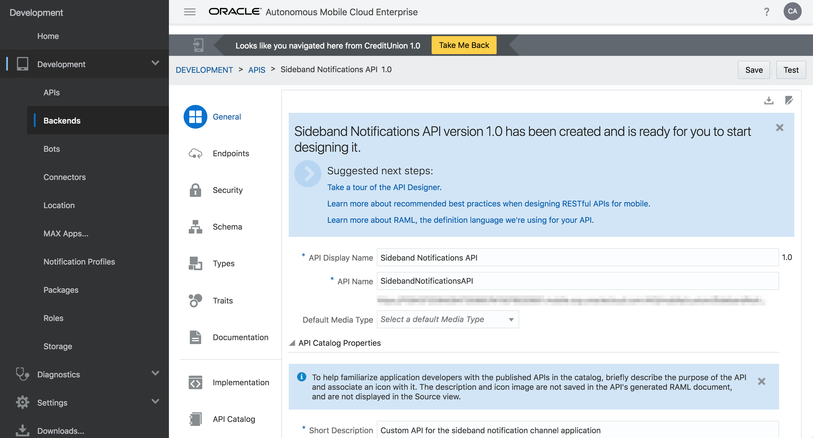

- In the **Default Media Type** dropdown, select **application/json**.

  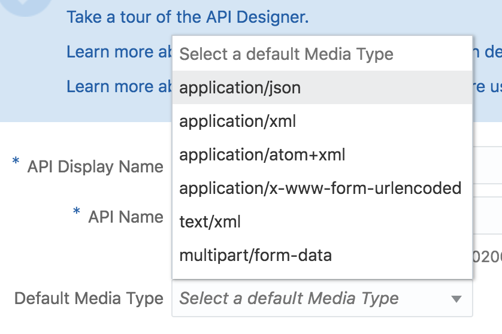

## Create Resource Endpoints

### **Step 3**: Create Endpoint for Loans Resource

- Click **Endpoints** from the Custom API page navbar and then click the **+ New Resource** button.

  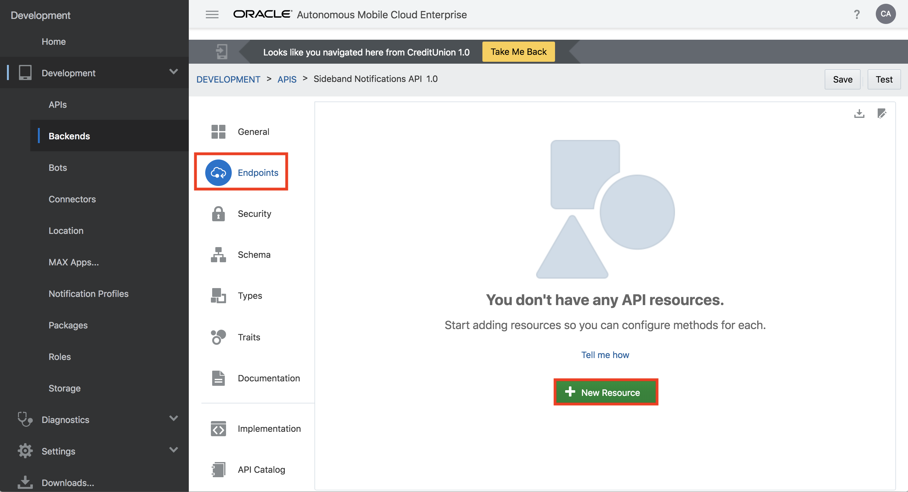

- Fill out the resource information as follows:

  **Resource Path:** `loans`

  **Display Name:** `Loans`

  **Resource Description:** `Loan notification profiles`

  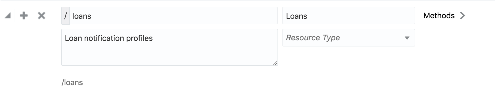

### **Step 4**: Create Endpoint for Loan Nested Resource

- To add a nested resource with route parameters, click the **+** sign  and fill out the nested resource information as follows:

  **Resource Path:** `{loanId}`

  **Display Name:** `Loan`

  **Resource Description:** `Loan notification profile`

  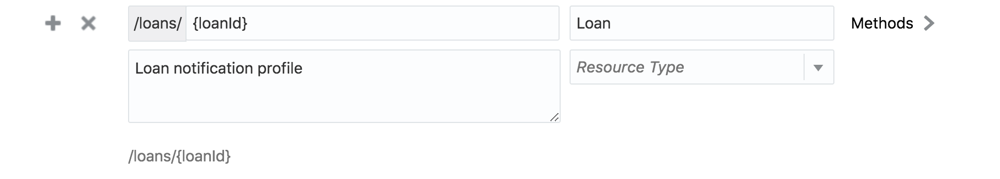

### **Step 5**: Create Endpoint for Dealers Resource

- Click **+ New Resource** again and fill out the resource information as follows:

  **Resource Path:** `dealers`

  **Display Name:** `Dealers`

  **Resource Description:** `Automobile dealership contacts`

  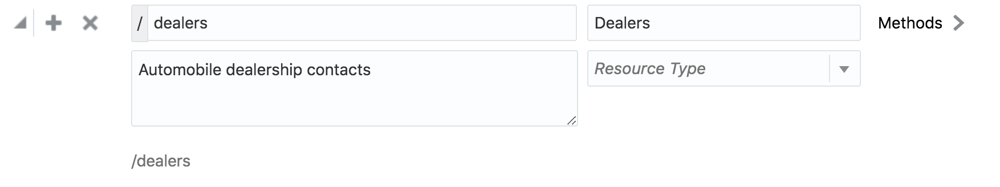

### **Step 6**: Create Endpoint for Dealer Nested Resource

- Click the **+** sign  and fill out the nested resource information as follows:

  **Resource Path:** `{dealerId}`

  **Display Name:** `Dealer`

  **Resource Description:** `Automobile dealership contact`

  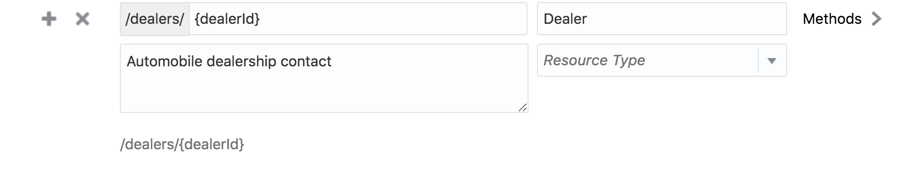

## Add HTTP Request Methods to Loans Resource Endpoints

### **Step 7**: Add GET Method to Loans Resource Endpoint

- Click **Methods** next to the Loans resource to navigate to the resource methods page and then click the **GET** option from the **+ Add Method** dropdown.

  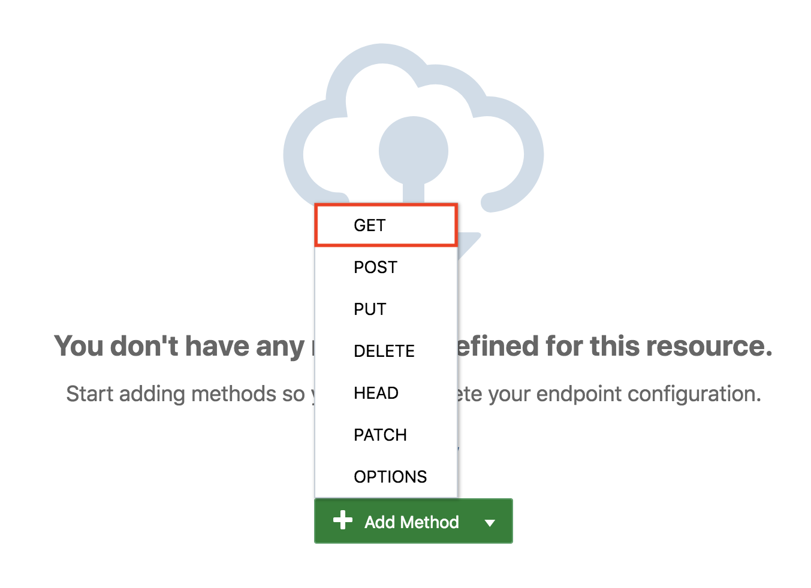

- Fill out the request description as follows:

  **Description:** `Get all loan notification profiles`

  **Display Name:** `Loans`

  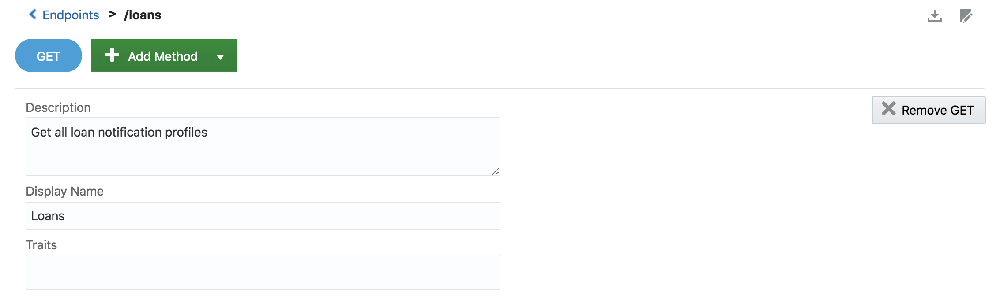

### **Step 8**: Add POST Method to Loans Resource Endpoint

- Click the **POST** option from the **+ Add Method** dropdown and fill out the request descripton as follows.

  **Description:** `Create new loan notification profile`

  **Display Name:** `Loan`

  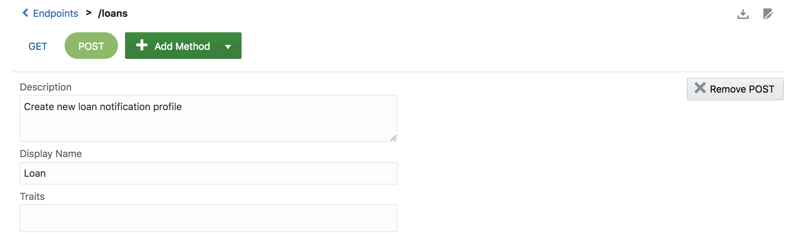

- Beneath the endpoint description, click the **Request** tab, click the **Add Media Type** button, and select **application/json** from the **Media Type** dropdown.

  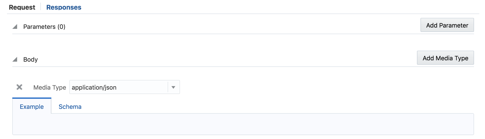

- Click the **Endpoints** breadcrumb to navigate back to the resource endpoints page.

  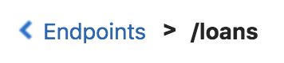

### **Step 9**: Add GET Method to Loan Nested Resource Endpoint

- Click **Methods** next to the Loan nested resource and fill out the nested resource information as follows:

  **Required:** `True (checked)`

  **Parameter Description:** `Unique ID of loan object`

  **Example:** `<'loan1.json' ID>`

  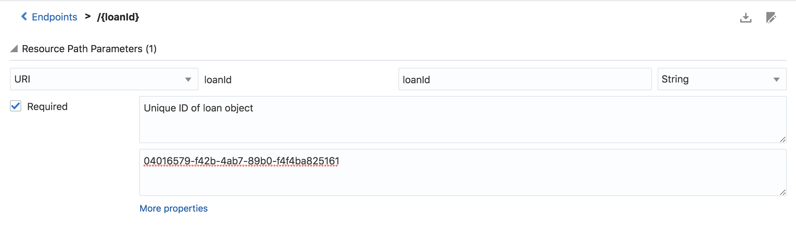

- Click the **GET** option from the **+ Add Method** dropdown and fill out the request information as follows:

  **Description:** `Get a loan notification profile`

  **Display Name:** `Loan`

  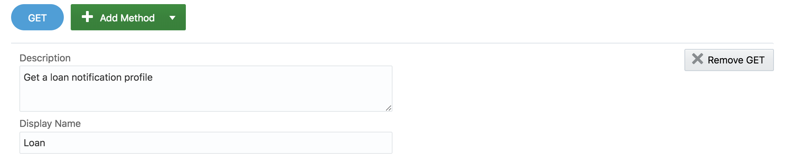

### **Step 10**: Add PUT Method to Loan Nested Resource Endpoint

- Click the **PUT** option from the **+ Add Method** dropdown and fill out the request descripton as follows.

  **Description:** `Update a loan notification profile`

  **Display Name:** `Loan`

  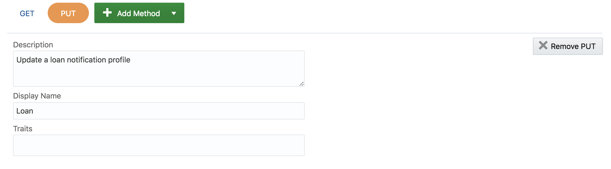

- Add **application/json** to the request body **Media Types**, as done in step 8.

### **Step 11**: Add DELETE Method to Loan Nested Resource Endpoint

- Click the **DELETE** option from the **+ Add Method** dropdown and fill out the request descripton as follows.

  **Description:** `Delete a loan notification profile`

  **Display Name:** `Loan`

  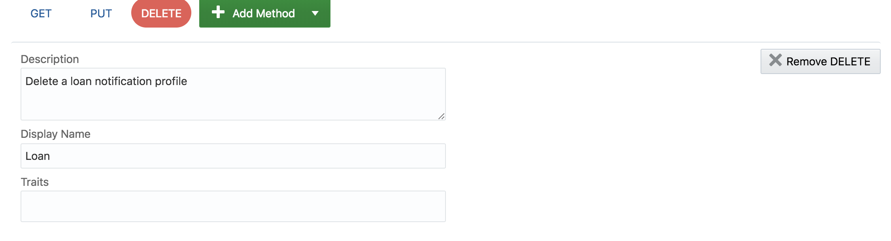

- Click the **Endpoints** breadcrumb to navigate back to the resource endpoints page.

  

## Add HTTP Request Methods to Dealers Resource Endpoints

### **Step 12**: Add GET Method to Dealers Resource Endpoint

- Click **Methods** next to the Dealers resource to navigate to the resource methods page and then click the **GET** option from the **+ Add Method** dropdown.

  

- Fill out the request description as follows:

  **Description:** `Get all dealer objects`

  **Display Name:** `Dealers`

  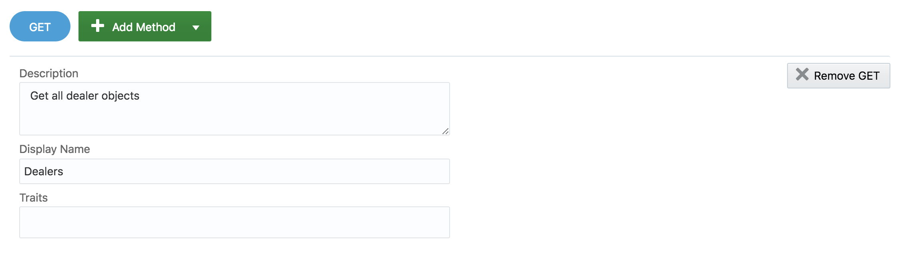

### **Step 13**: Add POST Method to Dealers Resource Endpoint

- Click the **POST** option from the **+ Add Method** dropdown and fill out the request descripton as follows.

  **Description:** `Create a dealer object`

  **Display Name:** `Dealer`

  

- Add **application/json** to the request body **Media Types**, as done in step 8.

- Click the **Endpoints** breadcrumb to navigate back to the resource endpoints page.

  

### **Step 14**: Add GET Method to Dealer Nested Resource Endpoint

- Click **Methods** next to the Loan nested resource and fill out the nested resource information as follows:

  **Required:** `True (checked)`

  **Parameter Description:** `Unique ID of dealer object`

  **Example:** `<'dealer1.json' ID>`

  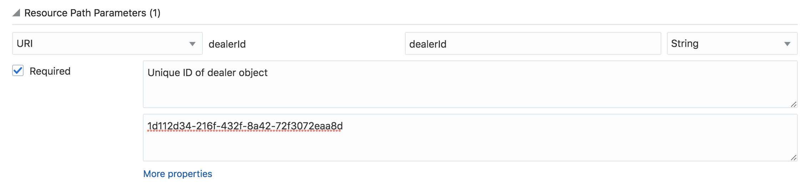

- Click the **GET** option from the **+ Add Method** dropdown and fill out the request information as follows:

  **Description:** `Get a dealer object`

  **Display Name:** `Dealer`

  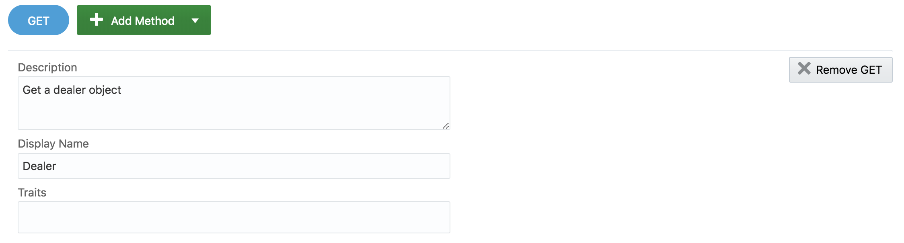

### **Step 15**: Add PUT Method to Dealer Nested Resource Endpoint

- Click the **PUT** option from the **+ Add Method** dropdown and fill out the request descripton as follows.

  **Description:** `Update a dealer object`

  **Display Name:** `Dealer`

  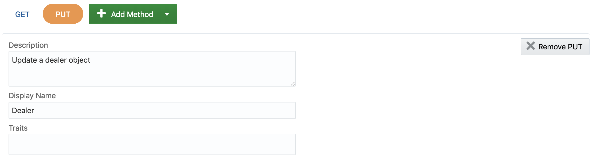

- Add **application/json** to the request body **Media Types**, as done in step 8.

### **Step 16**: Add DELETE Method Endpoint to Dealer Nested Resource

- Click the **DELETE** option from the **+ Add Method** dropdown and fill out the request descripton as follows.

  **Description:** `Delete a dealer object`

  **Display Name:** `Dealer`

  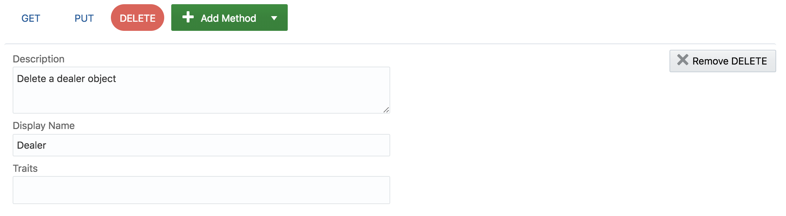

- Click the **Endpoints** breadcrumb to navigate back to the resource endpoints page.

  

- Click **Save** in the top right-hand corner of the page.

### **Step 17**: Set API Access

The last thing we'll do before actually implementing our API is to set the security configuration so that (a) only the roles we defined in **LabGuide100** can access our API in general and (b) access to each endpoint is restricted to only the roles that need access.

- Click **Security** from the API page navbar, toggle the **Login Required** button, and add **LoanProcessor** and **Dealer** to **Roles** under **API Access**

  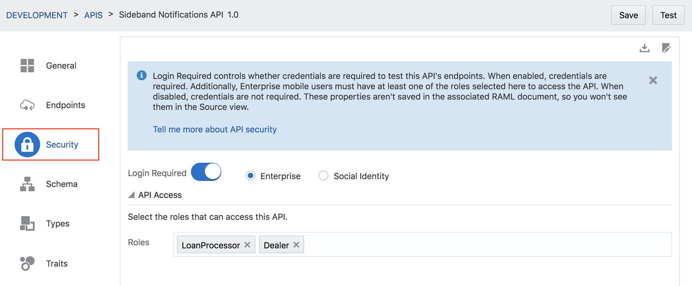

### **Step 18**: Set Endpoint Access

- Under **Endpoint Access** set the **Endpoint** & **Roles** as follows:
  - `GET Loans` - **LoanProcessor**, **Dealer**
  - `POST Loans` - **LoanProcessor**
  - `GET Loan` - **LoanProcessor**, **Dealer**
  - `PUT Loan` - **LoanProcessor**, **Dealer**
  - `DELETE Loan` - **LoanProcessor**
  - `GET Dealers` - **LoanProcessor**, **Dealer**
  - `POST Dealers` - **LoanProcessor**
  - `GET Dealer` - **LoanProcessor**, **Dealer**
  - `PUT Dealer` - **LoanProcessor**, **Dealer**
  - `DELETE Dealer` - **LoanProcessor**

  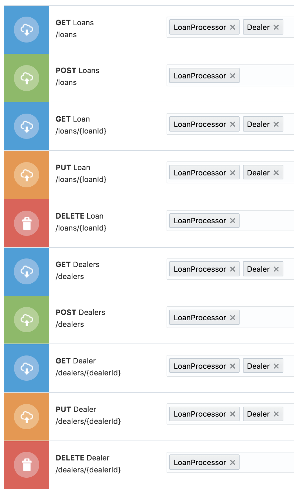

- Click **Save** once again in the top right-hand corner of the page.

# Implement Custom API

## Download API Implementation Archive

### **Step 19**: Download API Implementation Archive

Now that we have created the necessary endpoints for our resources, we have to add the actual implementation code for each. Fortunately for us, the **API Platform** of AMCe provides a downloadable **JavaScript scaffold** of our current API design.

- Click **Implementation** from the API page navbar and click the **JavaScript Scaffold** button to download your archive.

  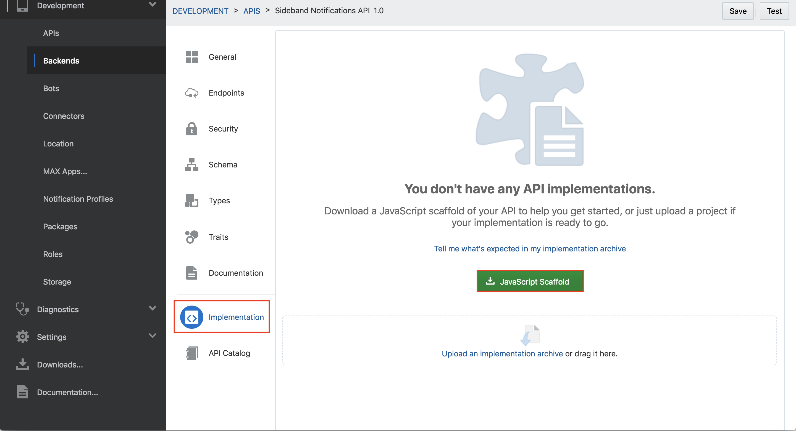

### **Step 20**: Configure Initial Implementation Archive

- Unzip the scaffold and check its contents. The directory should contain the following files:
  - `package.json` - the module manifest
  - `<api name>.js` - your starter implementation
  - `<api name>.raml` - the API definition in RAML format
  - `swagger.json` - the API definition in Swagger format
  - `toolsConfig.json` - contains metadata needed by the tools, such as backend environment and authorization info, the API, and AMCe endpoint and test definitions
  - `samples.txt`
  - `README.md`

- In the `toolsConfig.json` file, for each of the `backend` keys, provide the values corresponding to your **AMCe MBE** information we took note of earlier.

  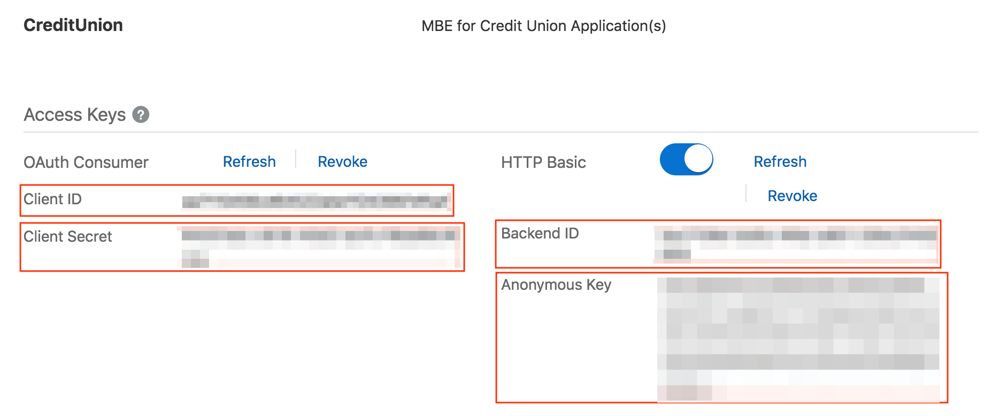

- For the two client keys in `tools.authorization`, provide the values found in the **Instance Details** of our **AMCe** environment.

  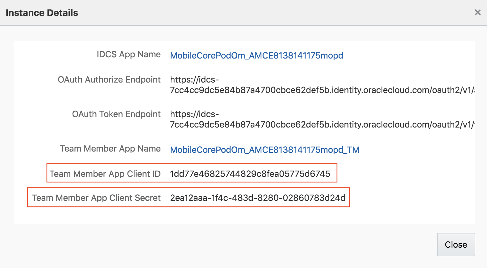

## Add API Implementation Code

### **Step 21**: Copy/Paste API Implementation Code

If we open up our `<api name>.js`, we see that all the work has already been done to set up the REST server, separate the logic in an appropriate manner, install the AMCe SDK, and define the endpoint methods. All we have to do now is fill in the blanks.

- Instead of actually writing out the implementations for each endpoint, we will save time by just copying/pasting code found in `api/api.js` of the workshop code directory we downloaded in the `UserGuide` pre-lab.

- Because we are using a custom `node_module` in our code, we need to install it before we can deploy our implementation. In your terminal, at the root directory of your API implementation, type the following command: 
  
  `npm install --save uniqid`

### **Step 22**: Deploy API Implementation

- Still in the root directory of your API implementation, type the following command to package and deploy your implementation: 
  
  `omce-deploy toolsConfig.json -u <AMCe username> -p <AMCE password>`

  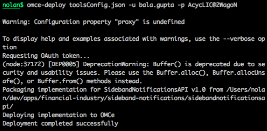

- Now, if we go to the **Implementation** section of our **API** page we will see our deployed archive as the API's current, active implementation.

  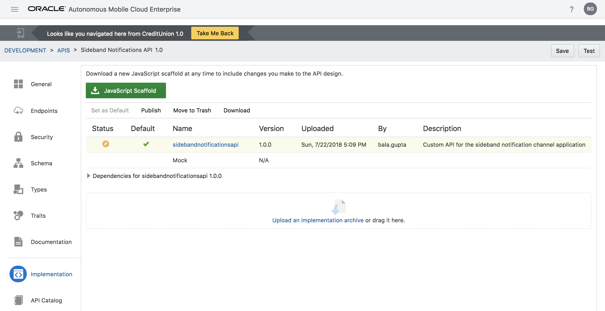

## Test API Implementation

### **Step 24**: Test Loans Endpoint(s)

Now that we have successfully deployed an implementation for our custom **API**, the last thing we want to do is actually test it. We will only test 1-2 endpoints for each resource to (a) demonstrate the **API Platform**'s testing feature and (b) ensure that we have proper access to our resources. That said, you are free to test each endpoint to thoroughly accurate implementation.

- To navigate to the **API** test page, click the **Test** button in the top right corner of your **API** page.

  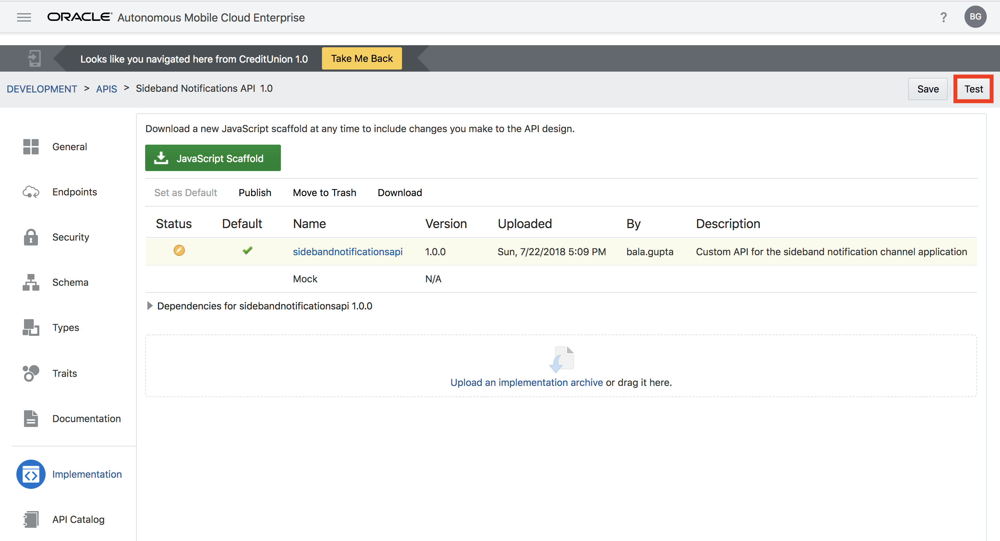

- Click the yellow **Default Test Credentials** button and set the default credentials form as follows and then click the **checkmark** to save your settings:

  **Backend:** `CreditUnion`

  **Authentication Method:** `OAuth Consumer`

  **Username:** `<AMCe username>`

  **Password:** `<AMCe password>`

- We will first test the **Loans** resource, starting with the **GET Loans** request. Click **GET Loans** and then click the **Test Endpoint** button. If successful, you should see a **Test Response Status:** 200 message and the response headers followed by the response JSON, which should be a list of loan objects.

  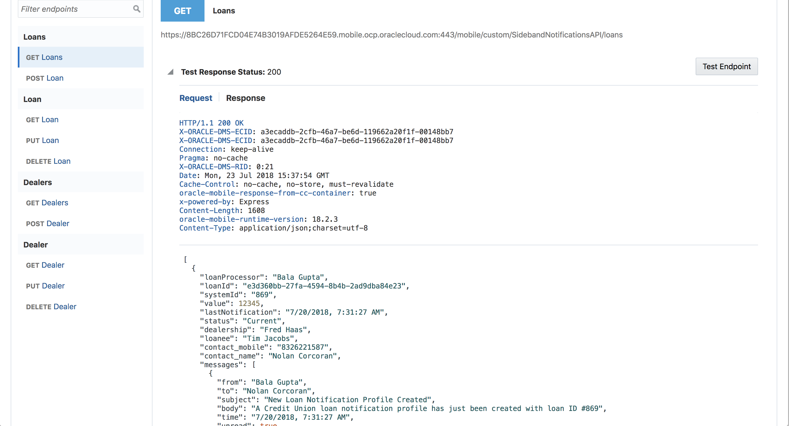

- You are now ready to move to the next lab.