# Registering Client Applications + Creating Notification Profiles

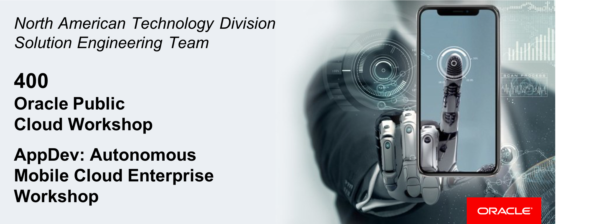  
Update: March 31, 2017

## Introduction

This is the fourth of several labs that are part of the Oracle Public Cloud **AMCe Application Development workshop.** This workshop will walk you through the Software Development Lifecycle (SDLC) for a dual-channel application (web + mobile) built using Oracle's Autonomous Mobile Cloud Enterprise (AMCe) as a complete backend solution.

In the previous 3 labs, we created & configured an AMCe environment & Mobile Backend project,we created & populated two object storage collections, and, lastly, we created & implemented a custom API. In this lab, we will create the mobile application and register it as a client within our **AMCe Mobile Backend (MBE)**.

**Please direct comments to: [Nolan Corcoran](nolan.corcoran@oracle.com)**

## Objectives

- Create Mobile Client Project
- Add Project Implementation
- Register App as MBE Client

## Required Artifacts

- The following lab requires an Oracle Public Cloud account that will be supplied by your instructor. Instructions are found in the Student Guide.

# Create *Dealer* Mobile Application

## Create Initial *React Native* Project

### **STEP 1**: Generate Project Boilerplate

- In your terminal, run the following command to generate our **React Native** project, which we call "client".

```console
react-native init client
```

### **STEP 2**: Configure Xcode Project Settings (specialization training)

- Confirm that you have recieved the following three files:
  - `ent3_inhouse_2019.p12`
  - `OCS_NAS_Demo5.mobileprovision`
  - `Oracle_Ent3.mobileprovision`

- Open up the **Xcode** project by double-clicking the `client/ios/client.xcodeproj` file.

- In the main project file, click the `client` **Target** and then click the **General** tab.
  - Under the **Signing** section, unclick **Automatically manage signing** (if it is checked)
  - Under the **Signing (Debug)** section, click the **Provisioning Profile** dropdown, click **Import Profile...**, and upload the `OCS_NAS_Demo5.mobileprovision` file.
  - Exit out of **Xcode** completely
  - Double click the `ent3_inhouse_2019.p12` file to add it to your **Keychain** (no password)
  - Re-open your **Xcode** project, select **Build Settings**, click the **Code Signing Identity** dropdown, and select **iPhone Distribution: Oracle Corporation (Ent 3)** (beneath *Identities in Keychain*)
  - Do the same for **Debug** and **Release** (if not done automatically)
  - Back in the **General** tab, change the **Bundle Identifier** to `com.oraclecorp.internal.ent3.ocsnas.demo5`

- Under **Deployment Info->Devices**, select `Universal`.

- Next, select the **Capabilities** tab, and, next to **Push Notifications**, toggle the option to **ON**.

- Lastly, delete completely the `clientTests`, `client-tvOS`, and `client-tvOSTests` targets.

### (DEPRECATED) **STEP 2**: Configure Xcode Project Settings

- Open up the **Xcode** project by double-clicking the `client/ios/client.xcodeproj` file.

- In the main project file, click the `client` **Target** and then click the **General** tab.
  - For **Bundle Identifier**, paste the Oracle Team **App ID**
  - Select `Automatically manage signing`
  - For **Team**, select the corresponding Oracle Team **Provisioning Profile**. Both the **App ID** and the **Provisioning Profile** information were provided in the **UserGuide** pre-lab.
  - Under **Deployment Info->Devices**, select `Universal`.
  
- Next, select the **Capabilities** tab, and, next to **Push Notifications**, toggle the option to **ON**.

- We also have to configure the `tests` **Target**, so click `clientTests`, select `Automatically manage signing`, and for **Team**, select the corresponding Oracle Team **Provisioning Profile**.
  
### **STEP 3**: Test Run Initial Application

- First, we will use the **React Native CLI** to run the **Xcode iOS Simulator** (for iPhone X). In your terminal, run the following commands:

```console
cd client
react-native run-ios --simulator="iPhone X"
```

- The iOS Simulator application should deploy with the front page of the React Native boilerplate project.

  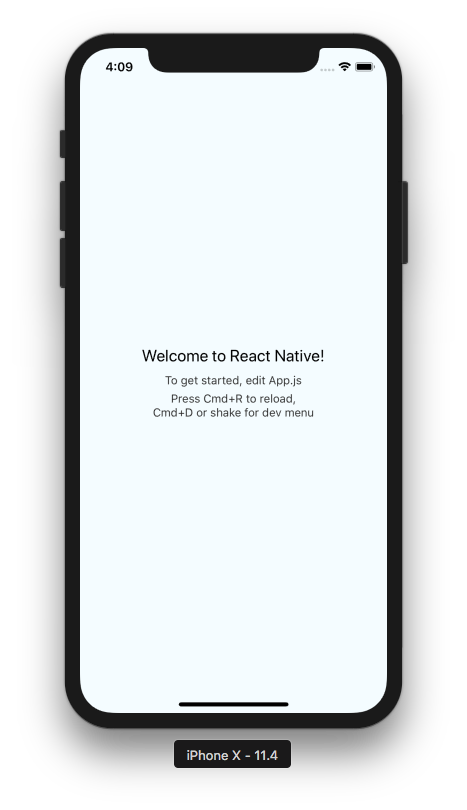

- After verifying the application is running properly, close the iOS Simulator and terminate associated processes.

## Add Project Implementation

### **STEP 5**: Add App Implementation Directory

Now that we have the **React Native** project properly built, let's add the directory which contains our project code and then edit the project configuration files to actually implement the code.

- In the project repository previously cloned in the pre-workshop `UserGuide`, copy the `app` directory and paste it into the root directory of your React Native project.

  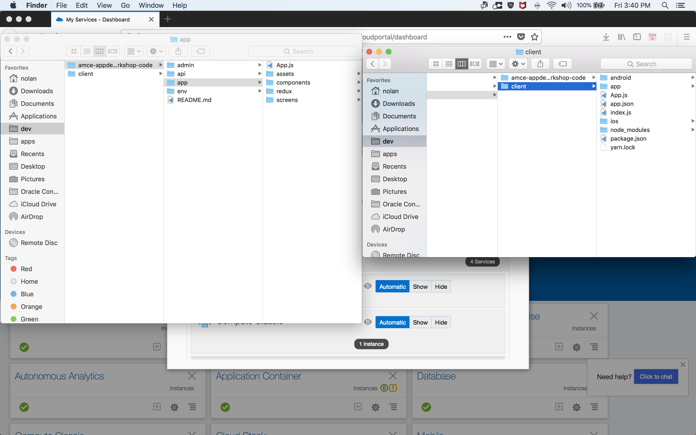

### **STEP 6**: Create/Edit Project Configuration Files

Right now, the `index.js` file is pointing at the wrong `App.js` file and the `package.json` does not reflect the required dependencies.

- In a text editor, open the `index.js` file in the project root and replace:

`import App from './App';`

with

`import App from './app/App';` 

- Now we can just delete the deprecated `App.js` file.

- Next, open the `package.json` file and copy/paste the following into `"dependencies"` (versions may vary):

```json
  "dependencies": {
    "art": "^0.10.3",
    "axios": "^0.18.0",
    "base-64": "^0.1.0",
    "buffer": "^5.1.0",
    "d3": "^5.5.0",
    "d3-shape": "^1.2.0",
    "lodash": "^4.17.10",
    "native-base": "^2.7.1",
    "prop-types": "^15.6.2",
    "react": "16.4.1",
    "react-native": "0.56.0",
    "react-native-icon-badge": "^1.1.3",
    "react-native-pull-to-refresh": "^2.1.3",
    "react-native-push-notification": "^3.0.2",
    "react-native-svg": "^6.4.1",
    "react-native-vector-icons": "^4.6.0",
    "react-navigation": "^2.6.2",
    "react-redux": "^5.0.7",
    "redux": "^4.0.0",
    "redux-persist": "^5.10.0",
    "redux-thunk": "^2.3.0",
    "utf8": "^3.0.0"
  }
```

- Lastly, in order for our project to reference the access keys and URLs of our **AMCe Mobile Backend**, we need to copy/paste the `config.js` file that we edited in `LabGuide100` into our project's root directory.

## Build Working Application

### **STEP 7**: Install and Configure App Dependencies

Now that we've added the application's implementation and edited/added the configuration files to reflect our changes, we will install the app dependencies defined in `package.json` and then link the **React Native** libraries to our Xcode project. Finally, we must manually link the `PushNotificationsIOS` and `ART` libraries as they use native iOS functionality.

- Use **npm** to install the `node_modules` defined in `package.json`.

  ```console
  npm install
  ```

- Use the **React Native CLI** to automatically link the newly installed **React Native** libraries to our actual Xcode project.

  ```console
  react-native link
  ```

  **IMPORTANT NOTE:** Before moving on, you will need to make the following code changes to match the specific naming conventions of your project.

  1. In `app/components/AMCe.js`, change all instances of `SidebandNotificationsAPI` to `SidebandNotificationsAPI_<AMCE_USER>` within the `endpoints` object.
  2. Still in `app/components/AMCe.js`, change `config.auth.groupIds.Dealers` to `config.auth.groupIds.Dealers_<AMCE_USER>` on line 156.
  3. Still in `app/components/AMCe.js`, change `com.creditunion.client.app` to the **Bundle Identifier** you used in your **Xcode** project.
  4. In `app/redux/actions/loanListActions.js`, change `'Loans'` to `'Loans_<AMCE_USER>'` on line 50.

### **STEP 8**: Manually Link PushNotificationsIOS and ART Libraries

We now have linked all of the **React Native** libraries except for the `PushNotificationsIOS` and `ART` libraries, which must be manually linked. To do so we will have to actually go into our Xcode project and edit the configuration settings/files to properly include the library.

**NOTICE** - The official **React Native** documentation of this process (for just PushNotificationsIOS), **including the corresponding screenshots**, can be found [here](https://facebook.github.io/react-native/docs/pushnotificationios.html) and the detailed steps for **Manual Linking** can be found [here](https://facebook.github.io/react-native/docs/linking-libraries-ios#manual-linking).

- In the `ios/` directory of your **React Native** project, open up the Xcode project called `client.xcodeproj`.

- Once we have the Xcode project pulled up, drag and drop the `.xcodeproj` files for both `PushNotificationsIOS` and `ART` into the `Libraries` group in your Xcode project. Both of these `xcodeproj` files can be found at `node_modules/react-native/Libraries/<ART or PushNotificationsIOS>/`. (**See Step 1 of Manual Linking instructions**)

  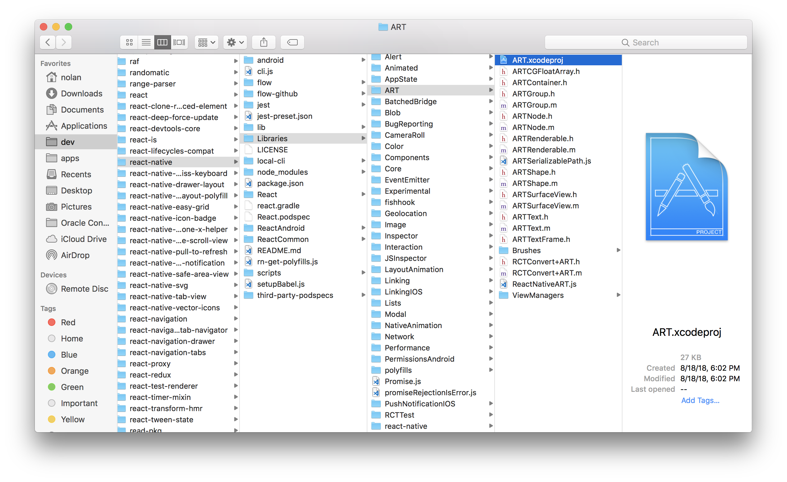

- Next, for both `.xcodeproj` files you just drag/dropped into the `Libaries` group, click the file's dropdown, click the `Products` dropdown, and drag/drop the static library (`lib<Library Name>.a`) to the `Link Binary With Libraries` section found in the `Build Phases` tab of the project's main `Target` settings. (**See Step 2 of Manual Linking instructions**)

- Because we will be calling this library from our native code, we must include the library's headers in our search path. To do so, while still within the main `Target` settings, select the `Build Settings` tab, and, under `Search Paths/Header Search Paths`, add the following library paths (**See Step 3 of Manual Linking instructions**):

    `$(SRCROOT)/../node_modules/react-native/Libraries/PushNotificationsIOS`
    `$(SRCROOT)/../node_modules/react-native/Libraries/ART`

  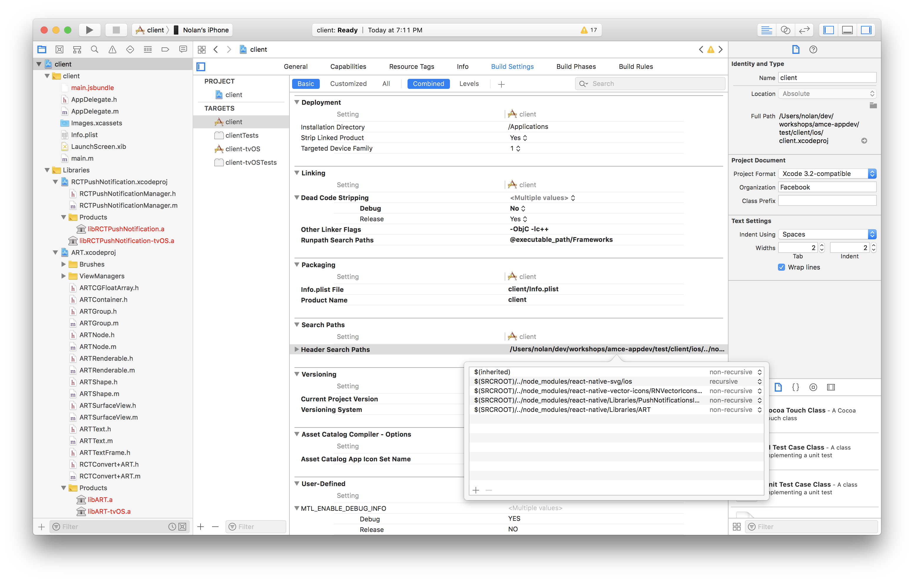

- Lastly, to enable support for notification and register events for the `PushNotificationsIOS` library you need to augment your `AppDelegate.m` as follows:

  At the top of your AppDelegate.m:

  `#import <React/RCTPushNotificationManager.h>`

  And then in your AppDelegate implementation add the following:

  ```
  // Required to register for notifications
  - (void)application:(UIApplication *)application didRegisterUserNotificationSettings:(UIUserNotificationSettings *)notificationSettings
  {
  [RCTPushNotificationManager didRegisterUserNotificationSettings:notificationSettings];
  }
  // Required for the register event.
  - (void)application:(UIApplication *)application didRegisterForRemoteNotificationsWithDeviceToken:(NSData *)deviceToken
  {
  [RCTPushNotificationManager didRegisterForRemoteNotificationsWithDeviceToken:deviceToken];
  }
  // Required for the notification event. You must call the completion handler after handling the remote notification.
  - (void)application:(UIApplication *)application didReceiveRemoteNotification:(NSDictionary *)userInfo
                              fetchCompletionHandler:(void (^)(UIBackgroundFetchResult))completionHandler
  {
  [RCTPushNotificationManager didReceiveRemoteNotification:userInfo fetchCompletionHandler:completionHandler];
  }
  // Required for the registrationError event.
  - (void)application:(UIApplication *)application didFailToRegisterForRemoteNotificationsWithError:(NSError *)error
  {
  [RCTPushNotificationManager didFailToRegisterForRemoteNotificationsWithError:error];
  }
  // Required for the localNotification event.
  - (void)application:(UIApplication *)application didReceiveLocalNotification:(UILocalNotification *)notification
  {
  [RCTPushNotificationManager didReceiveLocalNotification:notification];
  }
  ```

### **STEP 10**: Test Run Initial App Implementation

Now we should have everything installed and configured to test run our initial app implementation. This time, however, instead of using the **React Native CLI** to run the iOS Simulator, we will build the project and run the iOS Simulator using Xcode.

- (**Optional**) Before actually running the app, if you would like to configure App Icon images, go to the `Images.xcassets` folder under the main project directory in your Xcode project, remove the existing `AppIcon` file, CMD+click and select the `Import` option, and upload the image set found at `app/assets/AppIcon.appiconset`.

  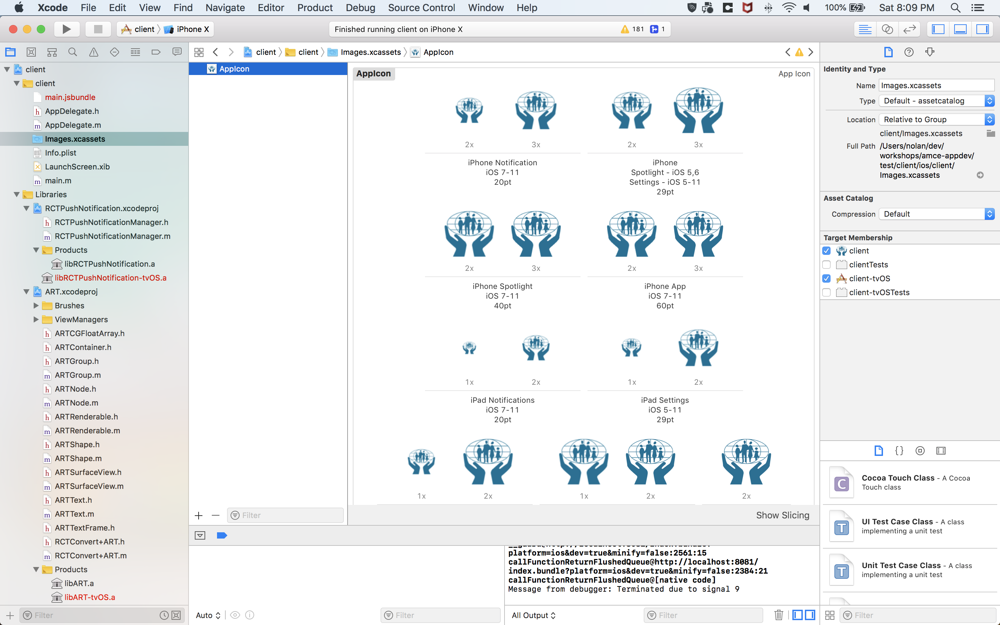

- On the left side of the top bar in Xcode, select the build `Target` (`client`), the iOS Simulator Device (e.g. `iPhone X`) to run it on, and then click the "Play" arrow button to build and run the current scheme.

  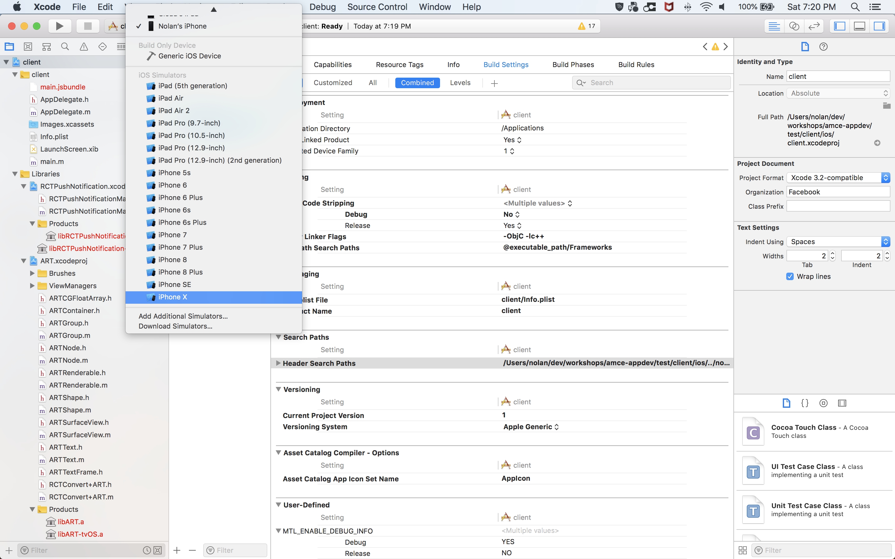

- Once the simulator is up and running, the application will try to pull up the home screen displaying our loan data, however, it will redirect to the Login screen as we are not yet logged in. Because we added ourselves to the `Dealers` group in `LabGuide100`, can just use your AMCe login information.

  

- Once logged in, you will be prompted to allow push notifications. Go ahead and select **Allow**, however our push notifications won't be working yet as Apple's APN server only provides unique device tokens for physical devices. You should now see the home screen displaying a dashboard of the Auto Dealer's loan profiles and a percentage breakdown of their loan values as so:

  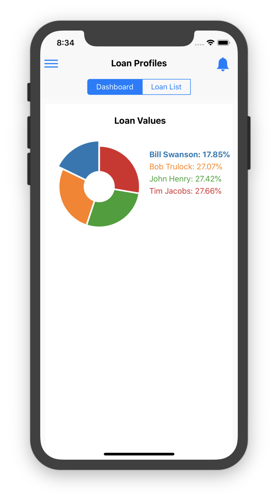

- Once you have verified that your mobile application is correctly working, stop the project by clicking the "Stop" square button.

# Register App as Mobile Backend Client

## Create Mobile Backend App Client & Notification Profile

### **STEP 11**: Create App Client

Now that we have our iOS client application succesfully built, we want to officially register it as a client of our **AMCe Mobile Backend**. This provides our **MBE** crucial metadata such as the `App ID`, the `App Version Number`, and, most importantly, a profile that contains notifications credentials which we will use to send push notifications to our mobile application.

- In the main **MBE** page, click the **Clients** section in the side navbar, click the **+ New Client** button, and fill out the new client creation form as follows:

  **Client Display Name:** `DealerApp`

  **Client Name:** `DealerApp`

  **Platform:** `iOS`

  **Mobile App Version:** `1.0`

  **Bundle ID:** `<Bundle Identifier in Xcode Project>`

  **Description:** `App Client for Dealer Mobile Application`

  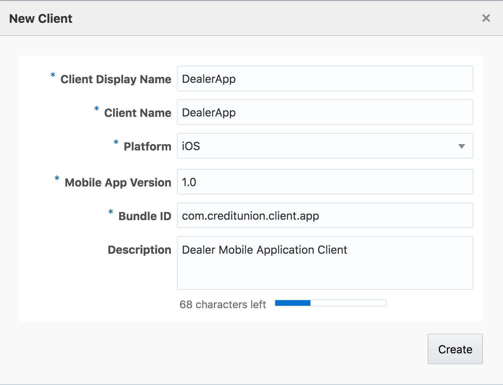

### **STEP 12**: Create Notification Profile

- Click the **Profiles** tab, click the **+ New Profile** button, and fill out the creation form as follows:

  **Name:** `DealerAppProfile`

  **Notification Service:** `Apple Push Notification Service (APNS)`

  **Description:** `Notification Profile for Dealer Mobile Application`

- For the **Certificate Type** and **Password Protected** fields, enter the details which correspond to the "Oracle Team" APNS Certificate.

- Lastly, upload your **P12** certificate and click the **Create** button

## Test Push Notifications

Now that our mobile application has been associated as a client of our mobile backend and we have created a notificate profile for our app, we can actually test our push notification service by building the app to our iOS device, registering our device with our backend, and then sending push notifications to our device using the **Notifications** console of our AMCe Mobile Backend.

### **STEP 13**: Explore Notificiation Console

- Navigate back to the **CreditUnion MBE** page and click the **Notifications** section in the side navbar to take us to the notifications admin console (If it is your first time clicking the **Notifications** section you will instead see a step-by-step diagram explaining how to implement push notifications. In this case just click **Don't see this option again**, click a different MBE section and then click the **Notifications** section once more).

- Here we see (1) a field for creating notification messages to send, (2) options for when to send our messages - either now or at later specified time - and (3) options for which devices to send our messages - either to all registered devices or to a filtered set of recipients (by Device ID, notification service, username, or Facebook ID). On the right side we see (4) the **History** section which gives us multiple options for viewing the status of the notifications we have already sent.

  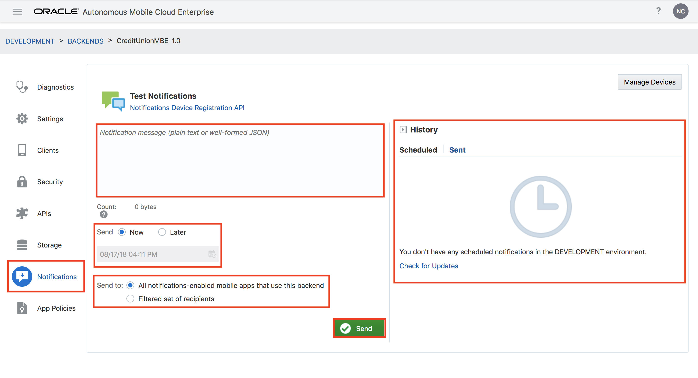

Lastly, if we click **Manage Devices** we can see which device have registered with our mobile backend application client. We have not yet built our app on our physical iOS device so there will not be any registered devices listed.

### **STEP 13**: Rebuild Mobile Application + Register Device

- To register your physical iOS device, we must  we must first build and run our app in the same way as we did in **Step 10** but this time we will connect our device to our laptop and select our device name among the build device dropdown options in Xcode instead of the `iPhone X` simulator option.

- Once the app has built, login as we did before and select **Allow** when prompted to enable push notifications. When we do this, Apple's APNS sends us a unique device token which we then use to call our backend's `Device Registration API`. To verify that we have registered our device correctly, click the **Manage Devices** button once more in our MBE's **Notifications** console and you should see listed under **Usernames** either your email if you logged in with your AMCe credentials or your mobile number if you registered a new user on the mobile app and logged in using those credentials.

  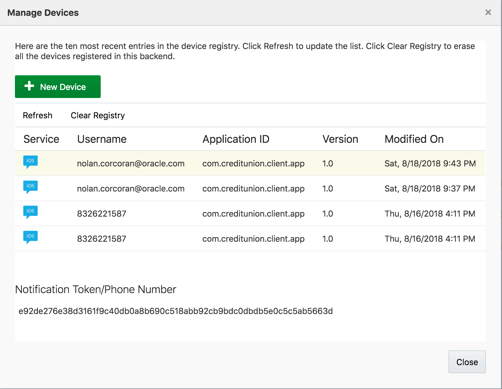

### **STEP 14**: Send Push Notification to Device

- To test if our push notification service has been implemented correctly, first, in the **Notifications** console, in the message text box, paste the following JSON payload:

```json
{
  "template": {
    "name": "#default",
    "parameters": {
      "title": "Test Message",
      "body": "This is a test message!",
      "sound": "alarm.wav",
      "custom": {
        "key1": "value1",
        "key2": ["value2", "value3"]
      }
    }
  }
}
```

- Then, for the **Send to:** option, select **Filtered set of recipients**, select **User** as the identifier dropdown, type the username that is associated with your device registration (your AMCe login email), and, lastly, click the **Send** button. If the app is open on your device you should see an alert popup with the notification message and if the app is not open you should see the expected iOS push notification.

  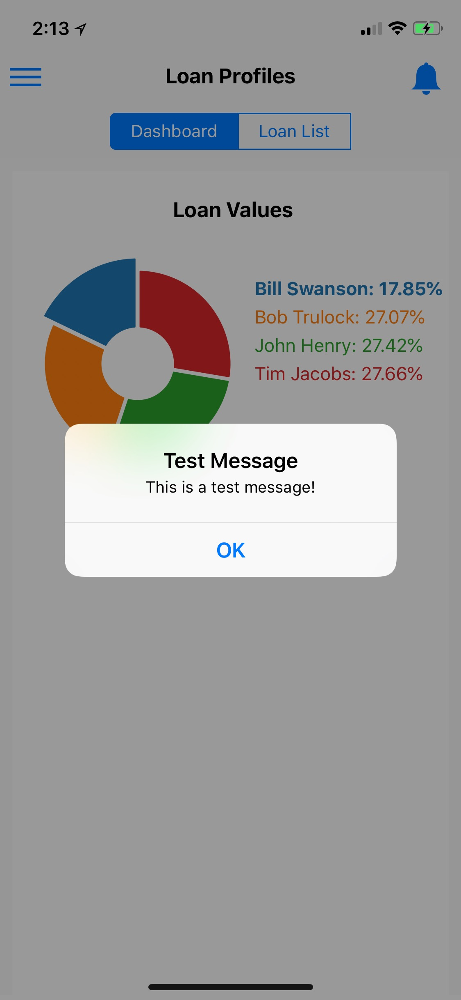

- In the **Notifications** console of the MBE page you will see something like the following in the message history:

  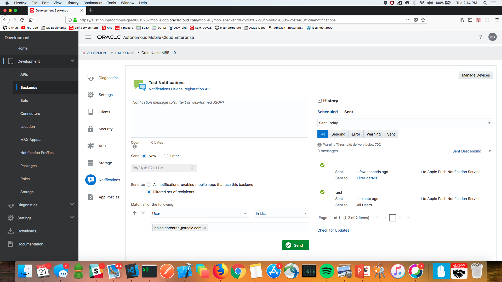

- You are now ready to move to the next lab.