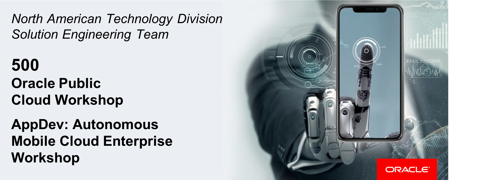
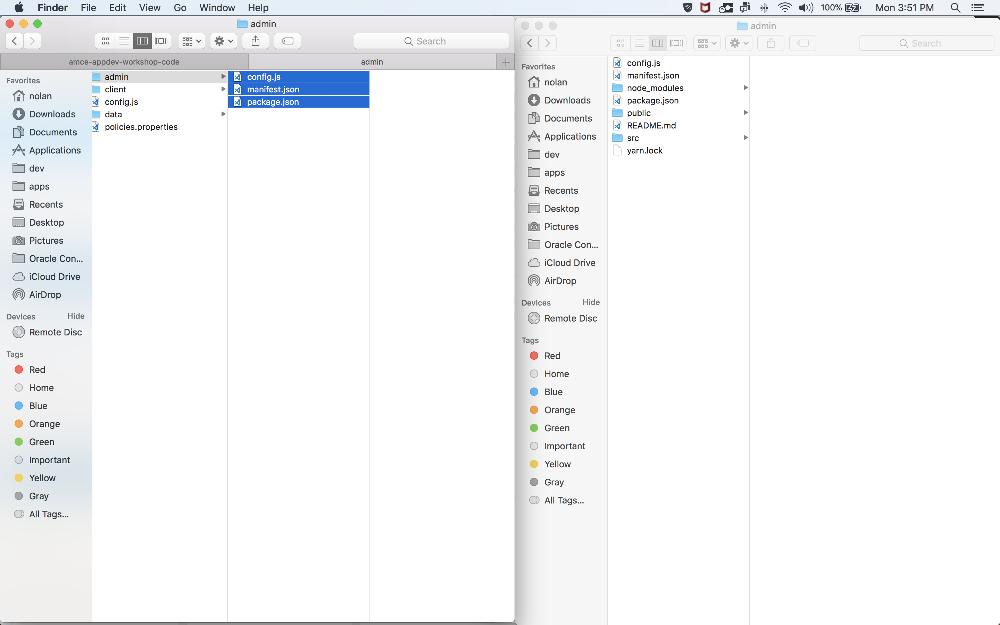
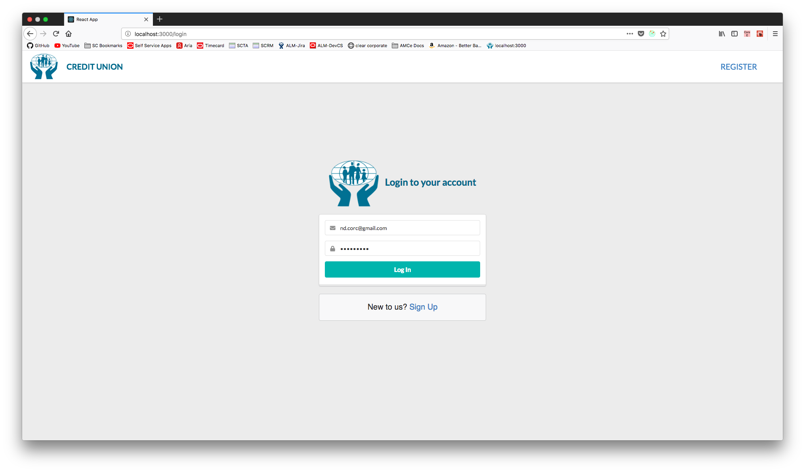
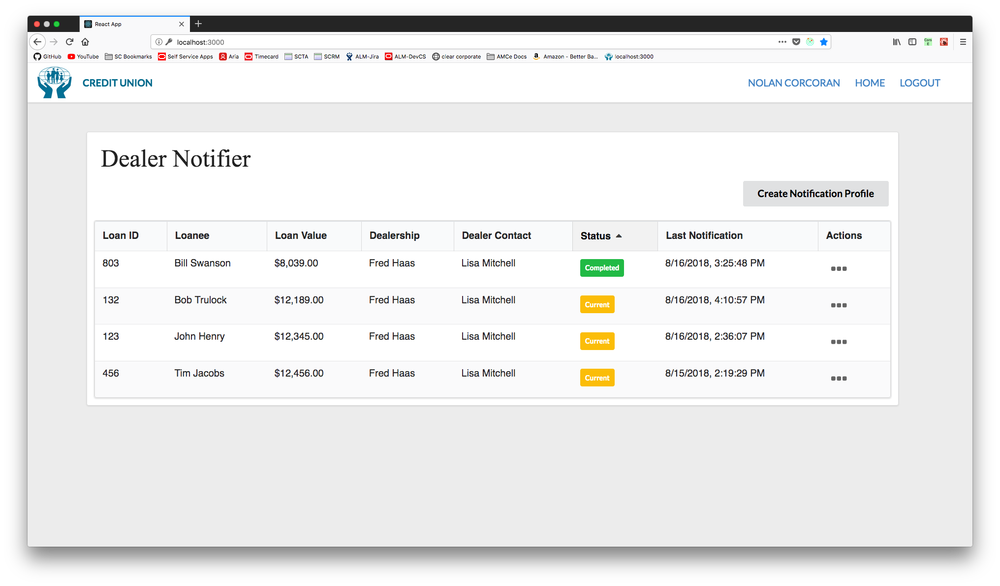
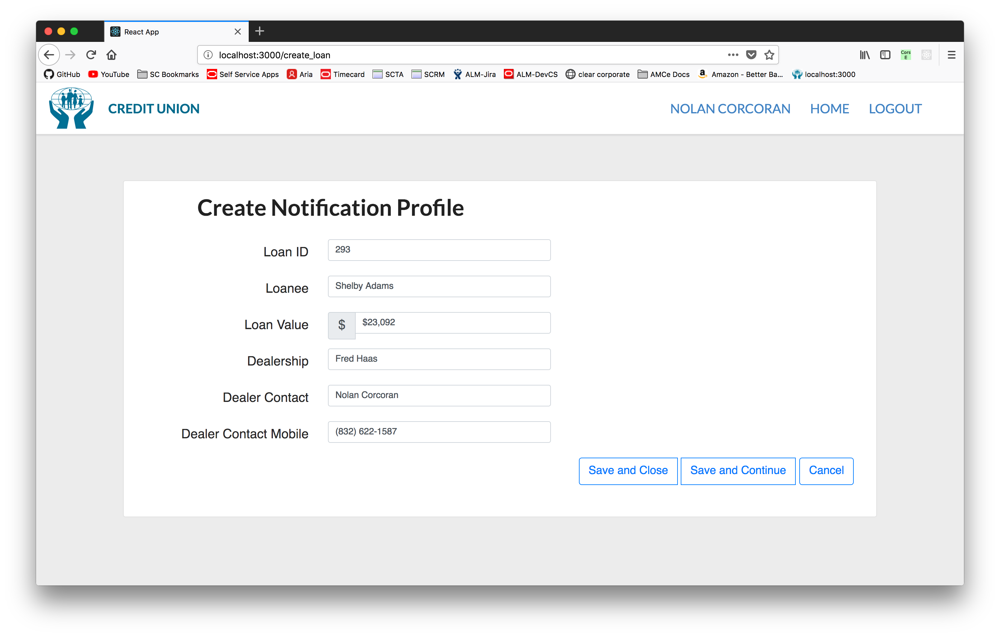
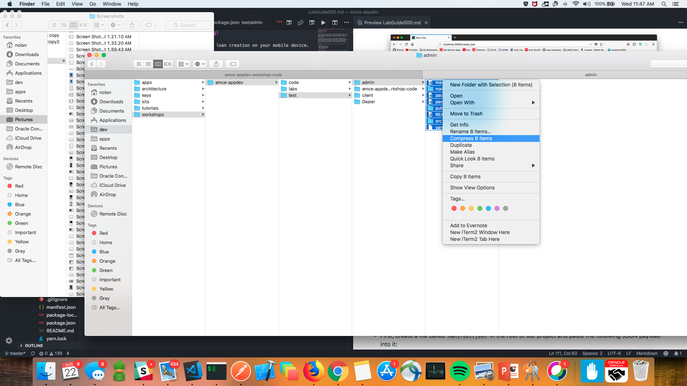

# Deploying Cloud Native Apps on Oracle Application Container Cloud Service

  
Update: March 31, 2017

## Introduction

This is the fifth of several labs that are part of the Oracle Public Cloud **AMCe Application Development workshop.** This workshop will walk you through the Software Development Lifecycle (SDLC) for a dual-channel application (web + mobile) built using Oracle's Autonomous Mobile Cloud Enterprise (AMCe) as a complete backend solution.

In the previous 4 labs, we created & configured an AMCe environment & Mobile Backend project along with two storage collections and a custom API. In the last lab we created our mobile application, associated it with our backend and tested this by sending push notifications to our device from our AMCe Notifications console. In this lab, we will create an admin web application to facilitate the push notification messaging and deploy it using **Application Container Cloud Service**.

**Please direct comments to: [Nolan Corcoran](nolan.corcoran@oracle.com)**

## Objectives
- Create Admin Web Application
- Add Project Implementation
- Deploy Application to ACCS
- Test Complete Solution

## Required Artifacts
- The following lab requires an Oracle Public Cloud account that will be supplied by your instructor.

# Create *Admin* Web Application

## Create React.js Project

### **STEP 1**: Generate Project Boilerplate

- In your terminal, run the following command to generate our **React Native** project, which we call "admin".

```console
create-react-app admin
```

## Add Project Implementation

### **STEP 2**: Add App Implementation Directory

Now that we have the **React** boilerplate project generated, let's add the directory which contains our project code and then edit the project configuration files to actually implement the code.

- In the project repository previously cloned in the pre-workshop `UserGuide`, replace the `src` directory with the one found in the root directory of your React project.

  

- In the `env/` directory of the workshop code, copy/paste the `config.js` file (that we edited in previous labs) and the 2 files found in the `admin/` directory into the root directory of your React project (replace `package.json`).

  

### **STEP 3**: Install Dependencies

- Now that you have the proper `package.json` in the root of your project, type the following command in your terminal (in the root of your project): `npm install`

## Test Application Locally

### **STEP 4**: Serve Web App Locally

Now that our application has been implemented, let's test it locally before we deploy it to the cloud.

- In your terminal, in the root directory of your project, type the command `npm start` and, in your brower, navigate to `localhost:3000`. You should be navigated to the login page as seen below.

  

- Because we added ourselves to the `LoanProcessors` group in **Step 1**, we can login using our **AMCe** credentials. Once logged in we should see a list of loan notification profiles as so:

  
  
### **STEP 5**: Test Push Notification Service

We've built this end-to-end application so that any changes that are made to the loan list by the admin, a corresponding push notification is sent to the mobile app we built in `LabGuide400`.

- Let's go ahead and test that this is working properly by hitting the **Create Notification Profile** button and filling in the loan creation form as follows:

  **Loan ID:** `293`

  **Loanee:** `Shelby Adams`

  **Loan Value:** `$23,092`

  **Dealership:** `Fred Haas`

  **Dealer Contact:** `<Your Name in AMCe>`

  **Dealer Contact Mobile:** `<Your Phone Number in AMCe>`

  

- You should recieve a notification of this loan creation on your mobile device.

# Deploy Application to ACCS

## Create Project Archive

### **STEP 4**: Compress Application Directory

Now that we have tested our app locally we can deploy it to the cloud using Oracle's **Application Container Cloud Service**. First, we need to create a `manifest` file which instructs our to-be container on how to run our app. Then we can compress our entire project into a `.zip` file and effectively deploy our app.

- First, create a file called `manifest.json` in the root of our project and paste the following JSON payload into it:

```json
{
  "runtime":{
    "majorVersion":"8"
  },
  "command": "npm start",
  "release": {},
  "notes": "Admin app"
}
```

- Next, compress your application directory into a `.zip` file. 

  **Note: Make sure to archive the files themselves from within the directory.**

  

## Deploy Node Application

### **STEP 5**: Login to your Cloud Account

- Navigate to `cloud.oracle.com`, `Sign In`, and enter your `Cloud Account Name` to go to your `My Services` dashboard.

  

- In your dashboard, click the **Application Container** service's **hamburger menu** dropdown, and then click the **Open Service Console** option.

  

### **STEP 6**: Create Node Application in ACCS

- In the service console, click **Create Application**, click the **Node** option, for give the application any name and, for **Application**, click **Browse**, upload the `.zip` we just archived in the previous step, and click **Create**.

  

## Test Complete Solution

### **STEP 7**: Access Deployed Application

- Once the application has been deployed, **click** the URL associated with app to navigate to the publicly deployed application.